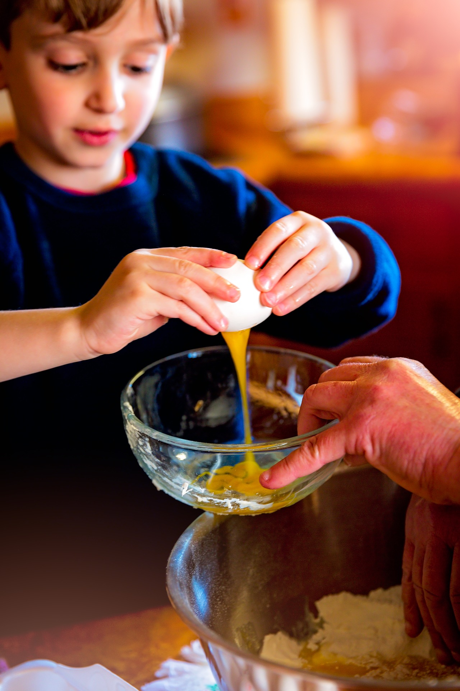

# 3.Otras consideraciones en la elaboración y distribución de los menús

Además, se tendrán en cuenta los siguientes aspectos:

*   Se fomentará desde el comedor escolar el conocimiento de los alimentos, así como el de los **aspectos gastronómicos y el gusto por las recetas** **tradicionales** de diferentes zonas geográficas del país o diferentes culturas.
*   Incluir **r****ecomendaciones sobre el resto de ingestas** del día que sean complementarias del menú escolar.

La oferta del comedor escolar debe ser suficiente, equilibrada, variada y saludable para los niños y niñas sin olvidar que les debe ser placentera. En efecto, además de proporcionar una comida de calidad nutricional e higiénica, la comida, en el colegio como en cualquier otro sitio, **debe ser un momento de placer para ellos** permitiéndoles disfrutar de una experiencia sensorial agradable, compartir con sus compañeros y compañeras este momento de buena convivencia, y descubrir los aspectos sociales, culturales, y gastronómicos que rodean el momento de la comida.

Los hábitos comienzan a adquirirse en el seno de la familia, y podemos comprobar que si a una persona adulta no le gusta determinado alimento y le preguntamos que comía de niño en su casa, seguramente comprobaremos que ese alimento no figuraba en el menú familiar.

Así mismo sabemos lo complicado, la **dedicación, la paciencia y la perseverancia** que se necesita hasta conseguir que un niño se habitúe a un alimento desconocido para él. Si a eso se une el cansancio, la falta de tiempo o el estrés de los padres, podemos caer en el error de sucumbir a darle solo aquellos alimentos que son de su agrado y come sin protestar, lo que le llevará a adquirir hábitos no saludables y que pueden derivar en una malnutrición.

Esta labor familiar, hoy **se comparte en gran medida con los profesores de las escuelas infantiles y colegios**, que disponen de conocimientos pedagógicos y psicológicos que han adquirido a lo largo de su carrera, a los que deben añadir conocimientos nutricionales necesarios que garanticen un control de los alimentos que proporcionan a sus alumnos en los comedores escolares, colaborando con los especialistas y las familias. A veces estas cometen errores involuntarios por desconocimiento y esta relación ayudará a corregir defectos en el propio hogar que mejoren su salud.

La hora del comedor debe considerarse como **una hora más de aprendizaje**, amena y agradable y que va desde habituar a los alumnos a las diferentes texturas y sabores en los más pequeños, a un posterior nivel de conocimiento de los diferentes alimentos y a la preparación de platos simples, con los alumnos a partir de los 3 años y la participación de los padres a través de talleres y actividades.

  

Fuente: [Pixabay.](https://pixabay.com/es/hornear-ni%C3%B1os-cocinar-la-educaci%C3%B3n-1951256/) Dominio público

**La Estrategia NAOS y el Programa PERSEO**, estableció los “**desayunos saludables**” en los Centros Educativos de Infantil y Primaria. Esta primera ingesta del día muy frecuentemente se realiza de manera insuficiente no dándole la importancia que tiene, incluso aún peor, en algunos casos no se realiza.Debemos saber que después del periodo de ayuno nocturno, el desayuno debe aportar los nutrientes que necesita el organismo como son los hidratos de carbono, las proteínas, los lípidos, las vitaminas hidrosolubles y liposolubles y los minerales (hierro, calcio, magnesio, cinc, etc.) y el aporte energético necesario para afrontar las actividades del día a día.El desayuno mediterráneo presentó un menú muy saludable compuesto por fruta, yogur, leche y pan con aceite de oliva virgen y tomate rallado, según las edades, esta experiencia tuvo gran acogida por parte de los alumnos y de los padres y se observó una mayor atención y rendimiento de los alumnos en el proceso de aprendizaje. Como complemento, se promovió la psicomotricidad y actividad física no competitiva (juegos) y la ordenación del descanso.

Son muchos los niños que van a los centros educativos sin haber dormido lo suficiente y si a esto le añadimos un desayuno deficiente tenemos una caída en los niveles de glucemia (que en los niños se produce más rápidamente que en los adultos), que se traduce en una apatía y somnolencia que impide la atención y la actividad. Además estos malos hábitos alimentarios y la falta de ejercicio potencian el riesgo de enfermedades cardiovasculares, obesidad (38% de nuestros niños presentan sobrepeso) y diabetes.

https://youtu.be/NLa5SANZ158

La **adquisición de hábitos saludables** viene facilitada por el desarrollo de las competencias básicas recomendadas por la UE y en cada uno de los niveles podemos desarrollar la lingüística (nombre de los alimentos), la matemática (introducción a los números, contar), la interacción con el mundo físico, la social y ciudadana (comedores), la cultural y artística (dibujar, colorear) y la autonomía e iniciativa personal que el Profesorado debe desarrollar en su Programación Anual de Centro. Además, es conveniente resaltar que las actividades con los padres en talleres de cocina y actividad física fortalecen el compromiso educativo de las familias no solo con el centro sino también entre ellas.