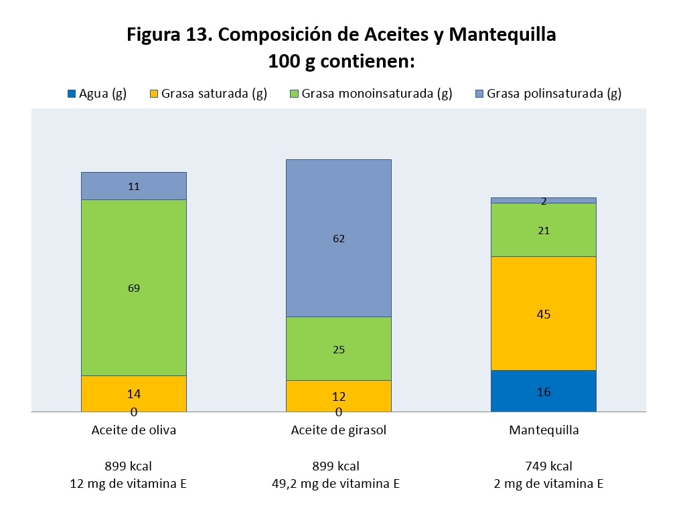

# Aceites y grasas

El grupo de aceites y grasas incluye alimentos de origen animal y vegetal que casi en su totalidad están compuestos por lípidos, es decir, grasas. **Aunque en todos ellos la composición sea básicamente lípidos, la calidad de éstos será muy distinta dependiendo del producto**; así, podrán ser más ricos en ácidos grasos monoinsaturados o poliinsaturados o saturados o incluso ácidos grasos tipo “trans”. Todos los alimentos pertenecientes a este grupo (aceites, mantequilla, margarina) poseen un elevado valor calórico.

Los aceites son líquidos llenos de grasa que obtenemos de las semillas o los frutos oleaginosos, es decir, los que contienen muchas grasas. El **[aceite de oliva](58-aceiteoliva.pdf "Aceite de oliva")** lo obtenemos de la aceituna, estrujándola para que salga todo su aceite. El **[aceite de girasol](59-aceitegirasol.pdf "Aceite de girasol")** de las pipas o semillas de girasol, pero en este caso las pipas, después de triturarlas las tratamos con disolventes, para que así se extraiga todo su aceite. También son aceites de semillas el aceite de soja o maíz. Algunas veces hay que refinar el aceite, para que sea menos ácido, tenga mejor sabor y olor y para que no contenga restos de las semillas que lo hagan estropear. Este refinado se hace siempre en los aceites de semillas, como el girasol, y algunas veces en el aceite de oliva.

La **[mantequilla](60-mantequilla.pdf "Mantequilla")** es una grasa, pero también es un derivado lácteo. La **[margarina](61-margarina.pdf "Margarina")** es una grasa que obtenemos de otras grasas de origen vegetal o de origen animal y que tratamos en la industria para que se parezca lo más posible a la mantequilla, pero más fácil de untar. La margarina nació en la búsqueda de un sustituto más barato de la mantequilla. Se debe a Meges Mouries en la época de Napoleón III. Tomó sebo vacuno, lo fundió y separó una fase sólida y una fase líquida. La fase sólida la utilizó para fines no alimentarios y la fase líquida la llamó oleomargarina. A la oleomargarina le añadió leche y extracto de glándula mamaria y obtuvo una emulsión: la margarina. Desde entonces, la producción ha aumentado mucho y es un producto de gran aceptación. En realidad, la margarina no es un derivado lácteo, pero su calidad organoléptica es muy similar a la de la mantequilla.

Los aceites vegetales son muy ricos en grasa monoinsaturada y polinsaturada, mientras que las grasas de origen animal como la mantequilla son más ricas en grasa saturada. Estos alimentos son también ricos en vitaminas liposolubles: el aceite de girasol es una buena fuente de vitamina E y el aceite de oliva proporciona más vitamina A (Figura 13).

Banco de imágenes de la FEN. _Composición de aceites y grasas_