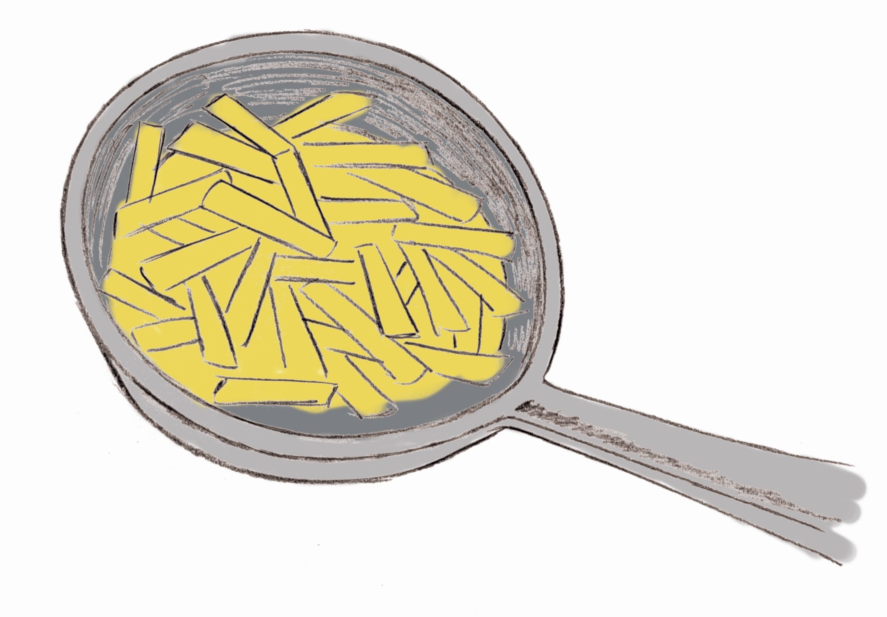

# Aceites y grasas

Una de las características distintivas de ambos productos es que los **aceites son líquidos y las grasas sólidas.** En los aceites insaturados, cuando se exponen al oxígeno del aire, la luz y el calor, la cadena carbonada se rompe precisamente por el doble enlace; se convierten así en saturados, con lo que sube el punto de fusión y el aceite se convierte en una grasa más estable.

Enranciamiento

*   Todos los aceites y grasas, tanto insaturados como saturados, están expuestos a la oxidación, el aire, la luz, el calor, los microorganismos y las enzimas que degradan con el tiempo estos aceites y grasas dando lugar a moléculas más pequeñas de olor desagradable (ácidos butírico, caproico y caprílico) responsables del sabor a rancio. Los aceites vegetales tienen antioxidantes naturales, como la vitamina E.

Lipólisis

*   Cuando se usan los aceites y grasas en la cocina, la humedad de los alimentos provoca que se enrancien; pero el calor y el agua rompen una pequeña parte de la grasa en sus componentes (ácidos grasos y glicerol), es decir, se produce una hidrólisis (lipólisis). Esto es lo que ocurre durante la fritura. Pero cuando se sobrecalienta el aceite y la grasa, el glicerol se rompe y se forma una sustancia llamada acroleína, que tiene olor picante y desagradable (altera el “flavor” del alimento).

##### Fritura de los alimentos

La fritura de los alimentos en baño de aceite se hace **elevando la temperatura a unos 180º C**. Al final, el producto tendrá entre un 5-40 % de aceite absorbido y habrá también cambios en el aceite durante la fritura. Se producirán compuestos volátiles, debido a las reacciones de oxidación: se generan más si el calentamiento es continuo que si la fritura es intermitente. Por esta razón cambia el aceite a lo largo de la fritura, aumentando la viscosidad, el contenido de ácidos grasos libres, adquiere un color oscuro y tiende a formar espuma. La presencia de alimentos hace que el aceite se oscurezca más rápidamente.

Los cambios del alimento en la fritura afectan, principalmente, al agua que se libera del alimento al aceite, con lo que el vapor arrastra los productos de oxidación volátiles del aceite. La nube de vapor que se forma encima del aceite reduce la cantidad de oxígeno disponible para la oxidación, por lo que los alimentos absorben cantidades variables de aceite.

Dos de las **ventajas principales de esta técnica culinaria**, que una de las características comunes a todos los países que siguen los patrones alimentarios de la denominada Dieta Mediterránea (sinónimo de dieta prudente y equilibrada), son la **baja agresión térmica** de que es objeto el alimento que se fríe (para defenderse de la agresión, crea alrededor una costra que impide que el centro del alimento alcance una temperatura elevada) y el **positivo cambio** que se produce en la composición lipídica cuando freímos alimentos grasos donde predominan los ácidos grasos saturados. Ya que, por diferencia de gradiente, parte de esta grasa saturada se queda en el aceite en el que estamos friendo el alimento y penetra en el alimento el aceite que estamos utilizando para freír (oliva o girasol principalmente).

Banco de imágenes de la FEN. _Patatas fritas_ (Todos los derechos reservados)