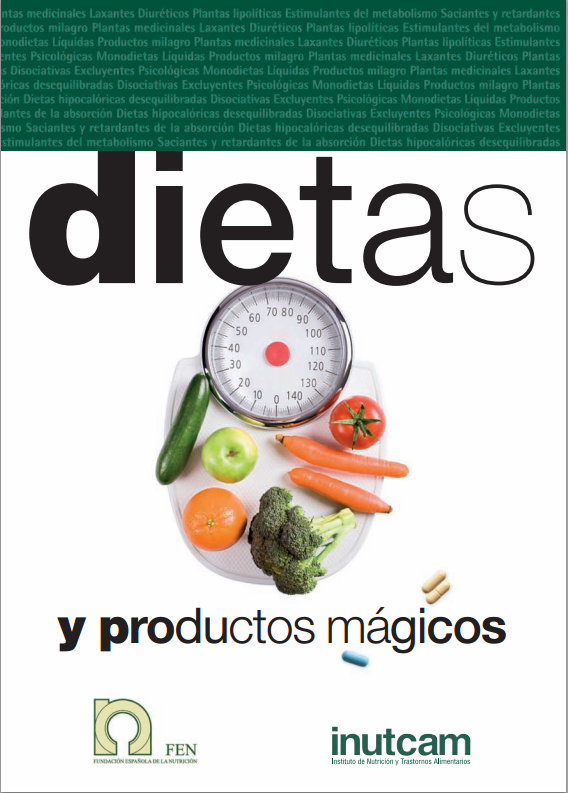

# ¿Adelgazar saludablemente?

Es muy habitual que después de pequeños _excesos_, tratemos rápidamente de perder los kilos que hemos ganado. Por ello, recordemos en primer lugar que **para adelgazar no son necesarios patrones alimentarios peculiares o exóticos ni _las dietas de moda_**. Aún más, las personas que adelgazan con éxito lo hacen lentamente y con seguridad, estableciendo hábitos alimentarios saludables, sin olvidar el adquirir un patrón de ejercicio moderado que debe durar toda la vida.

Como sabemos, la energía se mide en calorías, y el objetivo de una dieta para adelgazar va a ser reducir el peso disminuyendo el consumo de energía que obtenemos de los alimentos y bebidas, para al mismo tiempo aumentar la energía que quemaremos a través del ejercicio, y de esta manera que el organismo utilice más energía de la que recibe. Una regla importante que debemos no olvidar es que una dieta para adelgazar debe proporcionar todos los nutrientes que necesita el organismo, aunque éstos deben provenir de un menor consumo de energía, en definitiva, alimentos nutritivos bajos en energía: verduras, frutas, carne magra, aves, pescado, productos lácteos desnatados,pan y cereales. No hay duda de que entre todos los componentes principales de la comida, es la grasa la fuente de energía más concentrada (9 kcal por gramo), más del doble que lo aportado por proteínas e hidratos de carbono. Además, el alcohol (7 kcal por gramo) es también una fuente importante de energía, y debe disminuirse el consumo. Existe muchas veces la creencia de que alimentos como el pan, arroz, patatas y pastas, hacen aumentar de peso. Sin embargo, la realidad es que no contienen mucha energía, siempre que no se coman acompañados de mucha grasa. Además, no olvidemos que los alimentos ricos en almidones tienen efecto saciante. Se debe adelgazar saludablemente, sonriendo, y con cabeza.

**¿Qué dietas no debes seguir? ¿Cómo debes realizar una dieta correctamente?**

FEN: [_Dietas y productos mágicos_](http://fen.org.es/storage/app/media/imgPublicaciones/181120093354.pdf)