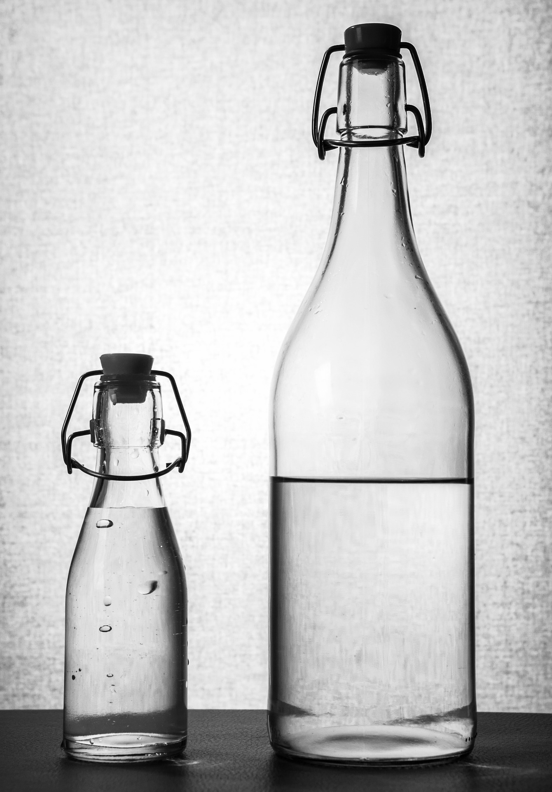

# Agua

Más del 60% de nuestro cuerpo es agua. El agua es el medio en el que se desarrollan todas las reacciones químicas celulares, sirve para transportar nutrientes y gases, lubrica y da soporte estructural a tejidos y articulaciones y es fundamental en la termorregulación. Diariamente nuestro organismo pierde agua en cantidades variables (orina, respiración, heces, sudor) que debemos recuperar mediante una ingesta adecuada. **Se puede sobrevivir meses enteros sin comer pero tan solo unos tres días sin beber**. Las necesidades hídricas para una persona adulta son, aproximadamente, 2,5 l/día. De ellos, aproximadamente la mitad se puede ingerir a través de los alimentos sólidos ya que, aunque no sean líquidos, prácticamente todos tienen una proporción notable de agua, sobre todo las frutas y las verduras. La otra mitad (aproximadamente 1,5 l/día) debe aportarse a través de la ingesta líquida. 

Fuente: [Pixabay](https://pixabay.com/es/botella-de-agua-el-agua-botella-2001912/)