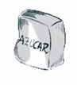

# Azúcares

El **azúcar** procede, o bien de la remolacha azucarera (un tercio de la producción) o bien de la caña de azúcar. La remolacha se lava, se corta y se hierve sometiéndola a presión; al jugo que se obtiene se le extraen los minerales y se concentra por evaporación para obtener cristales de azúcar. El último paso es la purificación y la destrucción de los microorganismos. La purificación depende del destino; por ejemplo no es igual si se destina a la industria chocolatera que si es para el hogar (que será azúcar blanco más puro). La caña se limpia, se corta, se tritura y se prensa; el jugo se filtra y se clarifica y se evapora. El rendimiento es muy alto: 98% de cristales puros.

Podemos distinguir varios tipos de azúcar:

*   **Azúcar refinado** (blanquilla), el que se consume en los hogares de forma mayoritaria, que tiene que tener por lo menos un 99% de sacarosa.
*   **Azúcar en polvo**, que es el azúcar anterior pero molido, y se le añade un agente antiapelmazante (almidón o fosfato cálcico).
*   **Azucarillos** (terrones de azúcar), azúcar refinado que se somete a presión mientras está húmedo.
*   **Azúcar candeal**, es un azúcar incoloro de cristales grandes porque durante su elaboración se evaporó el agua muy rápidamente (se emplea como conservante y en licores escarchados).

Los jarabes son un líquido viscoso que procede de materias residuales de la industria azucarera. Deben tener, como mínimo, un 30% de azúcar.

  

Banco de imágenes de la FEN. Paquete de azúcar (Todos los derechos reservados)

**Procesos que alteran los azúcares**

Vamos a hablar de unos procesos que son las reacciones de pardeamiento de tipo no oxidativo, o no enzimático: la caramelización y la reacción de Maillard.

Caramelización

*   El calentamiento directo de los azúcares y jarabes da lugar a unas reacciones que en conjunto se denominan caramelización. Es favorecido por pequeñas cantidades de ácidos y sales.La sacarosa es muy utilizada para la elaboración de colores y aromas de caramelo; se calienta en una solución con ácidos o sales de amoníaco, obteniéndose muchos productos que se usan en confitería y en bebidas (refrescos de cola, cerveza).

Reacción de Maillard

*   Es la reacción que se produce cuando interaccionan proteínas o aminas con hidratos de carbono. El azúcar se deshidrata y se forman subproductos, como el HMF (5-hidroximetil-2-furaldhído), que producen una pigmentación y un aroma a tostado.