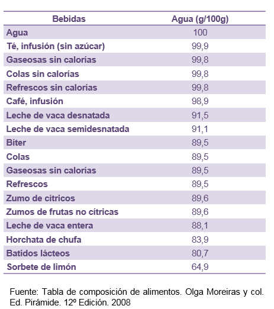

# Bebidas

Para calmar la sed, nada mejor que las bebidas, y de todas las bebidas, el **[agua](http://www.fen.org.es/mercadoFen/pdfs/agua.pdf "Agua")**. Puede ser agua del grifo o agua envasada, como el agua mineral natural o el agua de manantial. En todos los casos debe ser agua potable, es decir, agua que esté lo suficientemente limpia y sana para que no nos haga enfermar. El agua mineral natural y el agua de manantial brotan de algunas fuentes especiales y son muy ricas en minerales.

En el **[grupo de las bebidas](http://www.fen.org.es/mercadoFen/pdfs/hidratacion.pdf "Grupo de bebidas")** también se incluyen los zumos, los néctares y las bebidas refrescantes. Todas incluyen en su composición una gran cantidad de agua, su valor energético es muy variable, de acuerdo al azúcar añadido, y algunas de ellas, como los zumos, contienen también cantidades variables de vitaminas. Las bebidas refrescantes son muy variadas en sabores y colores. Zumos y néctares proporcionan mucha vitamina C. También hay bebidas calientes, como el café y el té, que no aportan nutrientes pero sí placer. Y bebidas para deportistas, como las isotónicas.

Y también existen **bebidas con alcohol**. Las bebidas alcohólicas son todas las que por diversos procesos (fermentación, destilación, adición) contienen alcohol etílico (etanol) en su composición. Su consumo suministra al organismo energía en distintas cantidades según el contenido alcohólico y de azúcares- Las bebidas fermentadas de baja graduación (**[vino](http://www.fen.org.es/mercadoFen/pdfs/vino.pdf "Vino"),  [cerveza](http://www.fen.org.es/mercadoFen/pdfs/cerveza.pdf "Cerveza") y [sidra](http://www.fen.org.es/mercadoFen/pdfs/sidra.pdf "Sidra")**) aportan cantidades variables de vitaminas, minerales y componentes no nutritivos de creciente interés.

Banco de imágenes de la FEN. _Contenido de agua en bebidas_