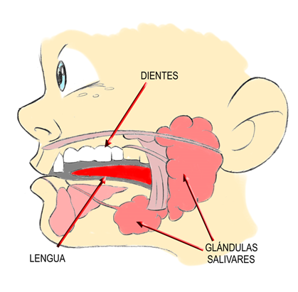

# Boca y faringe

En la cabeza tenemos la **boca**, rodeada por los labios; dentro están los **dientes,** son muy duros y tienen distintas funciones: los incisivos cortan, los caninos desgarran y las muelas trituran. Que tengamos dientes tan distintos es porque somos omnívoros, es decir, nuestra dieta es muy variada y comemos todo tipo de alimentos. El recién nacido no tiene dientes, cuando el bebé comienza a tomar alimentos sólidos, aparecerán 20 dientes temporales o deciduos, que serán reemplazados por 32 dientes permanentes en el adulto (8 incisivos, 4 caninos, 8 premolares y 12 molares). Los dientes están dispuestos en dos hileras con forma de herradura o arcadas dentarias: la superior está en los huesos maxilares y la inferior en la mandíbula, que es el hueso que se mueve y se acerca a los dientes superiores. Como somos omnívoros, realizamos movimientos como los roedores (con los incisivos, que los movemos de arriba a abajo), como los carnívoros (con los caninos, de delante a atrás) y como los rumiantes (con los premolares y molares, de lado a lado).

La masticación es el movimiento coordinado y armónico de la mandíbula con los dientes, los labios, la lengua y otros músculos de la cavidad bucal, como los que forman las mejillas. Estos movimientos son tanto voluntarios o conscientes, como involuntarios o inconscientes.

En la boca también tenemos la **lengua**, es muy musculosa y además de amasar los alimentos tiene las papilas gustativas, que nos informan del sabor de los alimentos.

Las **glándulas salivares**se clasifican en menores y mayores. Las menores son de pequeño tamaño y están repartidas por la mucosa de las mejillas, el paladar o la base de la lengua. Las mayores son órganos macroscópicos que se disponen rodeando la mandíbula; son seis, tres a cada lado. Si levantamos la lengua, en la parte inferior de la boca se pueden ver las glándulas sublinguales a los lados del frenillo de la lengua, con un pequeño orificio de desembocadura de otras de las glándulas, las submandibulares. La parótida es la más grande de las glándulas mayores, está detrás de la mandíbula y debajo del oído, y cuando se inflama produce paperas u orejones. Las tres glándulas segregan entre 1 y 2 litros de saliva al día. La saliva varía según lo que comemos: los alimentos secos provocan intensa secreción de saliva fluida, mientras que los alimentos líquidos producen saliva viscosa Sin saliva, masticar y tragar el alimento es una tarea realmente difícil.

Banco de imágenes de la FEN. _Boca_

La **lengua** es muy musculosa y mezclará la saliva con los alimentos para formar el bolo alimenticio: es la **digestión mecánica**. La saliva sirve para empezar a romper los alimentos en partículas más pequeñas mediante enzimas: es la **digestión química**. Además, la saliva sirve para destruir parte de las bacterias ingeridas con los alimentos e impedir que pasen a nuestro interior.

La parte siguiente del tubo digestivo se llama **faringe**; está en la parte posterior de la nariz, la boca y la laringe, alcanza la parte superior del cuello y es un tubo donde se cruzan el aparato digestivo y el respiratorio. Cuando tragamos, el paladar blando con la campanilla se pone horizontal y aísla las fosas nasales, y la laringe también se cierra. Estos movimientos reflejos nos protegen de la entrada de alimentos en el sistema respiratorio. La única vía que queda libre es el esófago, por donde descenderá el bolo alimenticio.