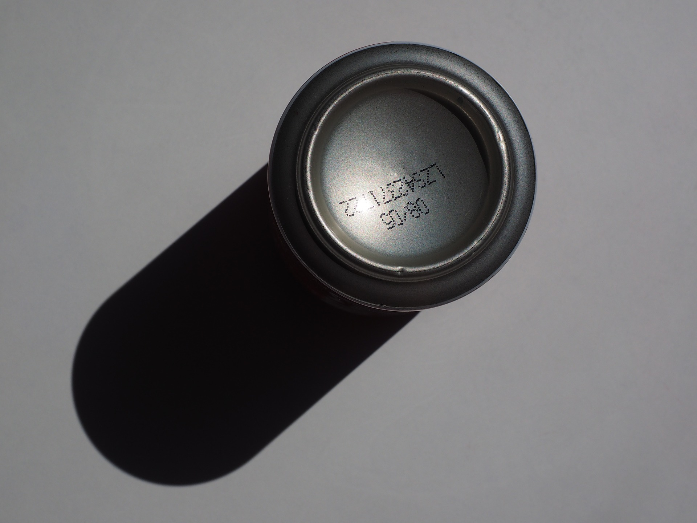

# Caducidad vs consumo preferente

Para evitar tirar comida, lo primero que debemos saber es interpretar las etiquetas de la misma y los conceptos que aparecen en ellas:

*   La **fecha de caducidad** se utiliza en alimentos muy perecederos y con riesgo microbiológico como carnes y pescados crudos, leche, platos precocinados, etc. Indica que a partir de esa fecha, el alimento puede ser peligroso para la salud, es decir, no es adecuado para consumirse desde un punto de vista sanitario; hay riesgos de que se encuentre en mal estado, estropeado y puede incluso ser peligroso por la presencia de bacterias patógenas.
*   La **fecha de consumo** **pr****eferente** se utiliza en alimentos como galletas, bollos, aperitivos salados, pastas secas, bebidas refrescantes, etc. Hace referencia a su duración mínima y que a partir de esa fecha su consumo no es perjudicial para la salud pero se pueden observar cambios en sus aspectos sensoriales (sabor, olor, textura, etc.), más o menos del agrado del comensal.

En cambio, hay otros **alimentos que no deben llevar obligatoriamente esta fecha de duración mínima**, como frutas y verduras frescas, vinos, licores, bebidas con una graduación de un 10% o más en volumen de alcohol, sal, azúcar, vinagre, panadería y repostería del día, determinados productos de repostería y gomas de mascar.

Por tanto, debemos utilizar los alimentos antes de que la fecha expire para garantizar sus propiedades nutricionales y características sensoriales. Si se va a consumir ese día, es más recomendado escoger alimentos que estén próximos a su fecha de caducidad,  por el contrario si no lo va a consumir de inmediato, escoja otro con fecha posterior, todo ello para evitar que el alimento se desperdicie. En cualquier caso, **no debemos descuidar las condiciones de almacenamiento y conservación de los alimentos** ya que la fecha de duración mínima no es una garantía sanitaria absoluta. 

  

Fuente: [Pixabay](https://pixabay.com/es/cuadro-dosis-cola-caja-de-piso-592371/)