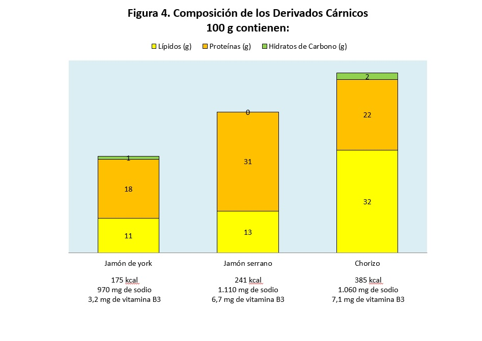

# Carne y productos cárnicos

Los alimentos incluidos en el grupo de las carnes tienen un elevado contenido de agua, proteínas de alto valor biológico, grasas entre un 3 y el 30%, y son fuente de vitaminas, del grupo B como B1, B2, equivalentes de niacina (B3) y B12 y minerales como hierro hemo, zinc, potasio y selenio. Son alimentos de **especial importancia durante el crecimiento y la edad avanzada**. El grupo de carnes y productos cárnicos está compuesto por la parte blanda de distintos animales, vísceras y despojos, embutidos y otros productos cárnicos.

La carne es el tejido muscular de animales de sangre caliente. Puede ser de distintos animales, las más comunes en España son **[ternera o vaca](7-ternera.pdf "Ternera")**, de **[cerdo](8-cerdo.pdf "Cerdo")**, de **[cordero](9-corderolechal.pdf "Cordero")** o de **[pollo](10-pollo.pdf "Pollo")**. También comemos carne de **[conejo](11-conejo.pdf "Conejo")**, de **[pavo](12-pavo.pdf "Pavo")** o de **[perdiz](13-perdiz.pdf "Perdiz")**. La carne se corta de diferentes maneras: en filetes, chuletones, chuletas, trozos o se pica para hamburguesas.

La carne de ternera es la menos grasa; cerdo y cordero contienen del 9 al 17% de grasa. Todas ellas aportan **muy buena proteína** y son fuentes principales de **hierro**, sobre todo las carnes rojas (Figura 3).

Banco de imágenes de la FEN. _Composición de la carne_

La carne es un **producto muy perecedero**, así que podemos fabricar derivados cárnicos, que nos permiten conservar la carne durante más tiempo y amplían la oferta de productos alimenticios. Por ejemplo, la pata del cerdo cocida es el [**jamón de York**](14-jamonyork.pdf "Jamón York") y la pata de cerdo salazonada y seca es el **[jamón serrano](15-jamonserrano.pdf "Jamón serrano")**.

En los **embutidos**, picamos la carne, la mezclamos con grasas, especias y la metemos dentro de una tripa. Dejamos pasar un poco el tiempo y crecen microorganismos (bacterias y levaduras), que al alimentarse de la carne van a liberar nuevos sabores y aromas. Luego, los embutidos se dejan secar y se conservan durante mucho más tiempo que la carne. El polvo blanquecino que recubre el salchichón o el chorizo es un microorganismo, un moho, que crece y se alimenta del embutido.

El jamón de york y el jamón serrano son muy parecidos en composición a la carne, pero contienen mucho más sodio, y los embutidos, como el chorizo, se enriquecen en grasa y calorías (Figura 4).

Banco de imágenes de la FEN. _Composición de los derivados cárnicos_

En la antigüedad, el hombre no conocía los microorganismos, pero sí sabía que los alimentos se deterioraban si no se consumían rápidamente. Para evitarlo, se vio obligado a idear formas para ampliar la vida útil de los mismos. Así, observó que la vida útil de la carne se prolongaba si después de picarla se mezclaba con sal y hierbas aromáticas y se desecaba tras su embutido, proporcionando un producto de sabor muy agradable. Parece que la elaboración de embutidos se inició unos 1.500 años a.C. Los embutidos crudos madurados tienen su origen en el área mediterránea, cuya climatología era y es muy favorable para su maduración. Desde entonces, estos productos se han diversificado y extendido por todo el mundo. Se podría decir que hay tantos tipos de embutidos como áreas geográficas y, aunque la base de su fabricación es siempre una combinación de procesos de fermentación (acción de los microorganismos) y deshidratación (pérdida de agua), existen claras diferencias regionales.