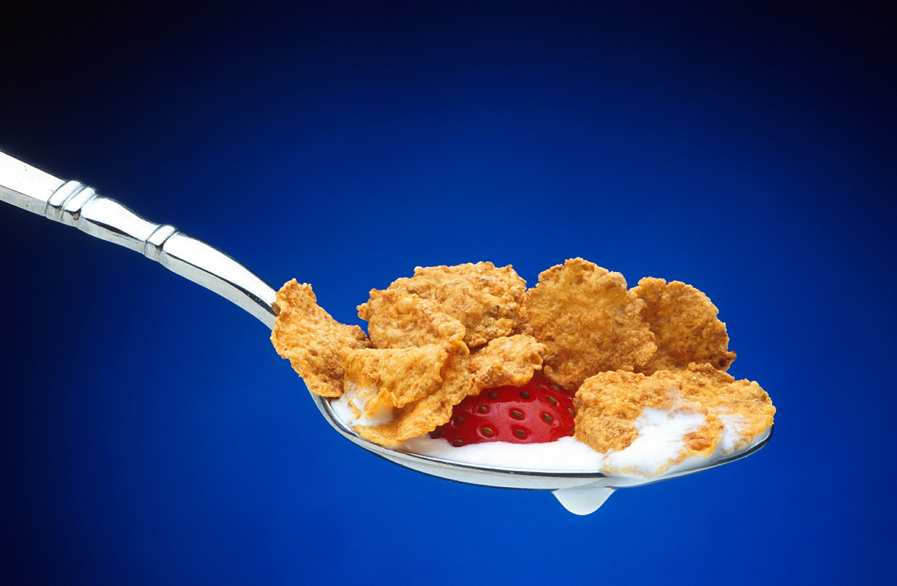

# Cereales: no todos son iguales

Los cereales son alimentos que desde luego **deberían constituir uno de los pilares fundamentales de nuestra dieta**. Estimamos que deberían aportar aproximadamente el 40% del aporte calórico de nuestras dietas. Por un lado, contienen hidratos de carbono, proteínas y, además, aportan cantidades importantes de fibra, vitaminas y minerales, siempre que no hayan sido sometidos a excesivos procesos de refinado. También es importante recordar que la cantidad de grasas es mínima, salvo que se hayan modificado en el procesamiento, dando lugar a muchos de los tipos de cereales para el desayuno, o aperitivos, a los que se les ha añadido grasa y azúcar.

El grano de cereal está formado por varias partes: cubierta externa, rica en fibra insoluble y vitaminas del grupo B, y que se desprende con la molienda del cereal dando lugar al salvado. Hoy sabemos que la riqueza en fibra insoluble del salvado de trigo es positiva para combatir el estreñimiento, mientras que el salvado de avena, rico en fibra soluble, puede contribuir a disminuir los niveles de colesterol y la glucemia. Además de la capa externa, el grano va a constar de dos estructuras: el germen, principal punto de interés nutritivo, contiene proteínas, ácidos grasos esenciales, vitaminas B1 y E, así como minerales. Por tanto, los cereales listos para el consumo, tal como los conocemos, suelen ser bajos en fibra, vitaminas y minerales, salvo que tomemos cereales integrales o bien cereales fortificados en nutrientes. Una recomendación final para una alimentación más equilibrada: la de aumentar el consumo de pan, pastas y arroz, y **no pensemos que todos los cereales que nos encontramos en el mercado son iguales**, ya que algunos es difícil reconocerlos como tales, precisamente a los que se les añaden azúcares sencillos y grasa, una práctica cada vez más habitual.

  

Fuente: [Pixabay](https://pixabay.com/es/cereales-cucharada-fresa-cuchara-556786/). Dominio público