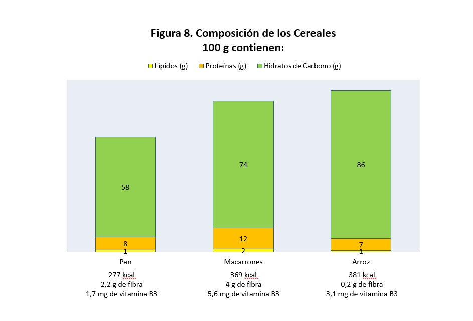
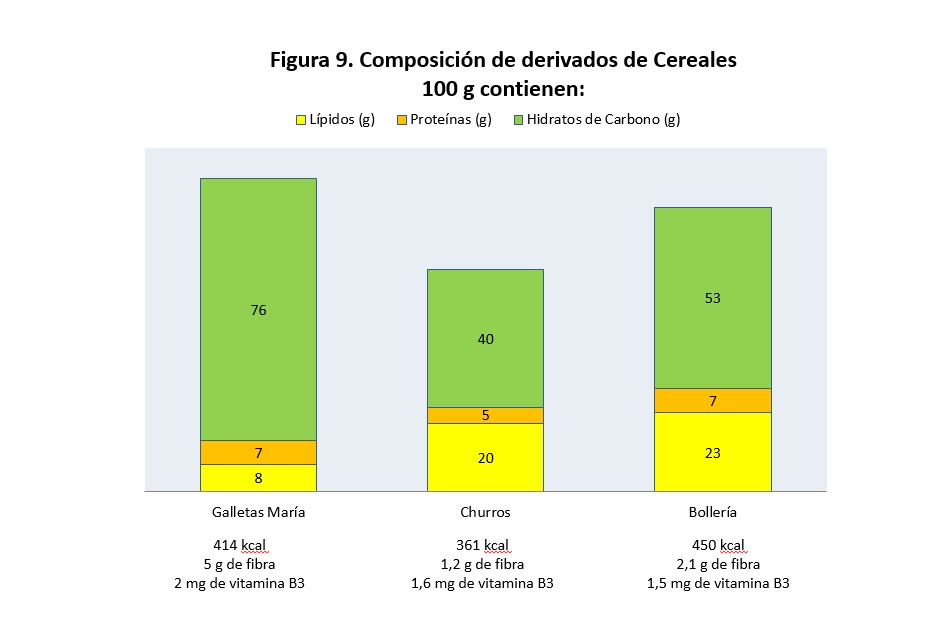

# Cereales y derivados

Los cereales constituyen **uno de los productos básicos de la alimentación de los pueblos mediterráneos**. Son los frutos maduros y desecados de ciertas plantas que pertenecen a la familia de las gramíneas y crecen como espigas. Las más importantes son el **trigo, el centeno, la cebada, la avena, el maíz y el arroz**. Su componente mayoritario son los hidratos de carbono complejos y, generalmente, no contienen prácticamente grasa. De ellas aprovechamos el grano, que es la semilla, eliminamos las envolturas que lo protegen y lo molemos hasta que obtenemos las harinas. En el arroz eliminamos las envolturas, pero normalmente nos quedamos con el grano completo sin triturarlo. Con las harinas podemos fabricar alimentos como pan, cereales de desayuno, pasta, galletas.

Son nuestra fuente de energía más importante y aportan también fibra y vitaminas del grupo B, aunque la fibra y las vitaminas son más abundantes en los cereales integrales (Figura 8). 

Bancos de imágenes de la FEN. _Composición de los cereales_

El trigo, el centeno, la cebada y la avena contienen una proteína denominada gluten, que provoca una reacción alérgica en las personas que padecen la enfermedad celíaca. Estas personas no pueden tomar gluten, pues cuando lo hacen se inflama y lesiona la mucosa que recubre todo nuestro sistema digestivo.

El **[pan](http://www.fen.org.es/mercadoFen/pdfs/panblanco.pdf "Pan blanco")** se elabora con harina, normalmente de trigo, agua, sal y levadura panaria. Se mezclan los ingredientes y lentamente se amasa, para que el agua se vaya mezclando bien con la harina. Luego se deja reposar y la levadura, que es el _Saccharomyces cerevisae_ (un microorganismo), empieza a fermentar. Como productos de desecho libera anhídrido carbónico y etanol. El anhídrido carbónico intenta salir de la masa, pero la red que ha formado la proteína del cereal (el gluten) no le deja salir. El gas empuja y la masa se va hinchando. Posteriormente se introduce en el horno. Esto hace que el anhídrido carbónico y el etanol se liberen como gases, consigan escapar de la masa pero dejan vacío el espacio que ocupaban. Así es como la miga se queda esponjosa y la corteza se carameliza.

Las **[pastas](http://www.fen.org.es/mercadoFen/pdfs/pasta.pdf "Pastas")** se elaboran con harina de trigo duro. Se mezclan con agua y sal, se moldean y luego se secan rápidamente. Al quitar el agua conseguimos unos alimentos que se conservan durante mucho tiempo.

Las **[galletas](http://www.fen.org.es/mercadoFen/pdfs/galletas.pdf "Galletas")** y la **[bollería](http://www.fen.org.es/mercadoFen/pdfs/bolleriaindustrial.pdf "Bollería")** siempre se hacen con harina de cereal, pero además hay que añadir otros ingredientes, casi siempre una grasa, que puede ser mantequilla, margarina o un aceite. También azúcar y otras veces chocolate, frutas, frutos secos y cremas. A medida que vamos añadiendo grasa, aumenta el valor calórico del alimento (Figura 9). 

Bancos de imágenes de la FEN. _Composición de derivados de cereales_