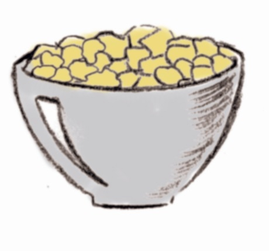
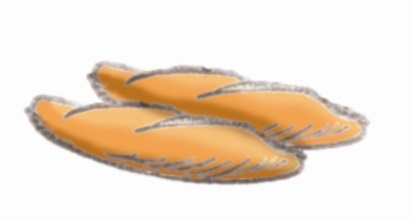

# Cereales y derivados

De los **cereales**, lo que aprovechamos es el grano (las semillas). Dichos granos están formados por: un núcleo central de almidón, un endospermo, que es muy rico en proteínas y que está cubierto por dos capas protectoras fibrosas e indigeribles: el salvado y la cáscara o cubierta. Además, está el germen que contiene una pequeña cantidad de grasa. 

Banco de imágenes de la FEN. _Cereales_ (Todos los derechos reservados)

**Harina**

La composición de la **harina blanca** es 80% almidón, 9,3% de proteínas, 1,2% lípidos, 3,4% de fibra, vitaminas y minerales.Cuando se muele el grano, se separan las partes más externas, el salvado (rico en vitaminas del grupo B y en fibra), y la más interna, el germen (con proteínas, ácidos grasos esenciales, minerales, vitamina E y vitaminas del grupo B) que puede enranciarse durante el almacenamiento. El pan blanco suele prepararse a partir del endospermo, por ello se recomienda también consumir habitualmente diferentes tipos de pan, como los integrales que incluyen el salvado, o panes elaborados de grano completo, que incluyen el salvado y el germen, y así beneficiarse del valor nutricional de estos.

La proteína del endospermo contiene aminoácidos esenciales: lisina, metionina, cisteína, treonina y triptófano, pero la calidad nutritiva de estas proteínas es peor que las de los animales, porque la mayoría de los cereales tienen poca cantidad de lisina. Estas proteínas se pueden complementar con las legumbres que si contienen lisina, aunque son deficientes en metionina.La cantidad de proteína en el endospermo aumenta desde el centro hacia la periferia; por eso, cuando se elimina el salvado durante la molienda también se está eliminando una gran proporción de proteínas.

Hay **trigo duro y blando**. El trigo duro tiene más dureza, es más vasto pero más frágil y tiene más cantidad de proteína. Se emplea para la preparación de semolina, pastas alimenticias (macarrones...) y masas que tengan que tener mucha elasticidad (pizza.) El trigo blando es más esponjoso porque hay aire entre las partículas de almidón. Se emplea para elaborar harina de pan blanco y de pastelería.Si la harina se almacena algunos meses, se hace más blanda y sus propiedades para la fabricación del pan mejoran, porque el oxígeno del aire oxida y blanquea los pigmentos amarillos que hay en la harina, y las proteínas que están rodeando al almidón se hacen más fuertes y rígidas (ayuda a la panificación).

La harina contiene un 70% de almidón, que tiene una estructura que impide que el agua entre en los gránulos pero cuando aumenta la temperatura (60º C) se rompen algunos enlaces de las moléculas de almidón y el agua puede penetrar, y se hincha, formando una especie de gelatina. Por eso se emplea la harina como espesante de sopas, cremas y purés.

Banco de imágenes de la FEN. _Harina_ (Todos los derechos reservados)

**Pan**

La **masa** tiene aspecto gomoso debido al gluten. Cuando se mezcla el agua con la harina se forma una especie de entrelazado entre las proteínas: se origina una red de proteínas rígida, estable y tridimensional (debido a los puentes disulfuro del aminoácido cisteína). El gluten va absorbiendo agua y se hace más duro, pero si se añade demasiada agua se queda como una sustancia fluida, sin elasticidad. A la masa se le suele añadir cisteína para mejorar la estructura del gluten y acelerar su formación y también leche en polvo, aumentando el valor nutritivo del pan. Las grasas son componentes auxiliares que ayudan a formar la estructura de la miga y de la corteza, influyen en la textura y colaboran a retrasar el envejecimiento del pan. La harina contiene un 1% de grasas, que se unen sobre todo al gluten; si se calientan por debajo de su punto de fusión aumentarán el volumen de la masa haciendo que el pan tenga aspecto más esponjoso y sea más suave al paladar.La sal se añade para mejorar el sabor, inhibir algo la actividad de la levadura y evitar el plegamiento de las redes de gluten; así se forma una masa más dura y el pan queda más denso. En el horneado, el agua se evapora. El almidón se hace más gelatinoso y las proteínas se coagulan. Éstas se adhieren al almidón manteniendo en el interior las burbujas de gas. Con ello también se consiguen el color y el aroma.

El pan va envejeciendo y se hace más seco porque las moléculas de agua se difunden hasta la corteza y allí se evaporan. Por tanto, si se protege al pan del aire se ayuda a retrasar este envejecimiento. En el pan tostado, el calor hidroliza parcialmente el almidón a un oligosacárido que es la dextrina (moléculas de glucosa), más solubles en agua. El organismo puede degradar más fácilmente estos hidratos de carbono y por tanto es más fácil de digerir. 

Banco de imágenes de la FEN. _Barras de pan_ (Todos los derechos reservados)

**Arroz**

La composición nutritiva del  **arroz** difiere algo de la del resto de cereales; tienen un 86% de almidón, 7% de proteínas, 1% de grasa, 0,2% de fibra, minerales y muchas vitaminas del grupo B, sobre todo en la cascarilla. Cuando el arroz se desprende de su espiga posee una piel o cáscara de color marrón, tiene un sabor fuerte y es más fácil de digerir que el arroz blanco o pulido porque tiene en el salvado más vitaminas del grupo B y por tanto es más nutritivo.El arroz comercial sufre una cierta trituración y precocción con vapor para que gelatinicen las partículas de almidón. Existe un tipo de arroz (sancochado) que ha sido tratado con vapor antes de separar la cáscara, con lo cual sus nutrientes pasan al grano y se mejora así su valor nutritivo.