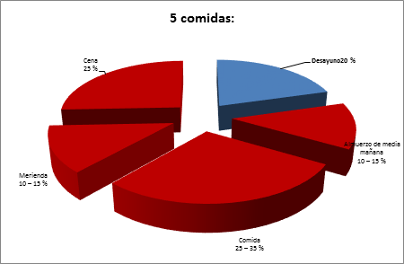
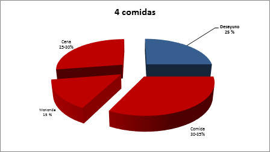

# ¿Cómo se pueden organizar las comidas a lo largo del día?

Lo mejor es hacer **4 o 5 comidas cada día** y que no sean demasiado abundantes, para evitar la sensación de pesadez y fatiga. Una distribución racional de la energía a lo largo del día contribuye a mantener estable el peso adecuado. Conviene que todas las comidas tengan un horario regular. Siempre que sea posible, se debe comer acompañado (familia, amigos, compañeros de trabajo) y no delante de la televisión, el ordenador u otras pantallas. Ello permite disfrutar más de la comida y controlar mucho mejor lo que se come, tanto en cantidad como en calidad. Es fundamental hacer todas las comidas habituales del día, ya que suprimir alguna de ellas, por ejemplo, el desayuno, implica llegar a la siguiente comida con una sensación de hambre excesiva, lo cual conduce a comer más, finalmente. 

Banco de imágenes de la FEN. _Distribución de la energía en 5 comidas_  

Banco de imágenes de la FEN. _Distribución de la energía en 4 comidas_