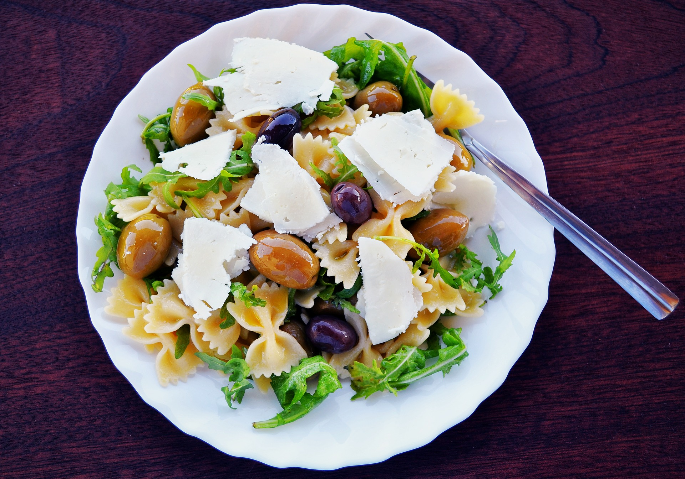

# Comida

En la **comida del mediodía**, que debe aportar aproximadamente un 25-35% de la energía diaria, conviene incluir tres platos. Esta costumbre tan usual en los hábitos alimentarios españoles permite incorporar a la comida numerosos alimentos que deben estar presentes en nuestra dieta diaria. El primer plato puede ser arroz, pasta, ensalada o verduras, guiso de patatas o legumbres; el segundo plato, de carne, pescado o huevos. Las guarniciones de los segundos platos de comidas y cenas son una opción magnífica para incluir verduras y hortalizas de forma habitual en la dieta, salvo que éstos constituyan el primer plato. En tal caso, para dar una mayor variedad, se pueden incluir como  guarnición el arroz, pasta, patatas, etc. Finalmente, un postre, que puede ser fruta fresca, preferiblemente, o un yogur. Todo ello siempre acompañado con pan y agua. Conviene probar las comidas antes de añadirles sal, porque generalmente ya han sido sazonadas en su preparación. Recuérdese que es muy bueno aliñar con aceite de oliva las ensaladas, tanto de verduras como de pasta, arroz o legumbres.

Fuente: [Pixabay](https://pixabay.com/es/ensalada-de-pasta-aceitunas-1967501/)