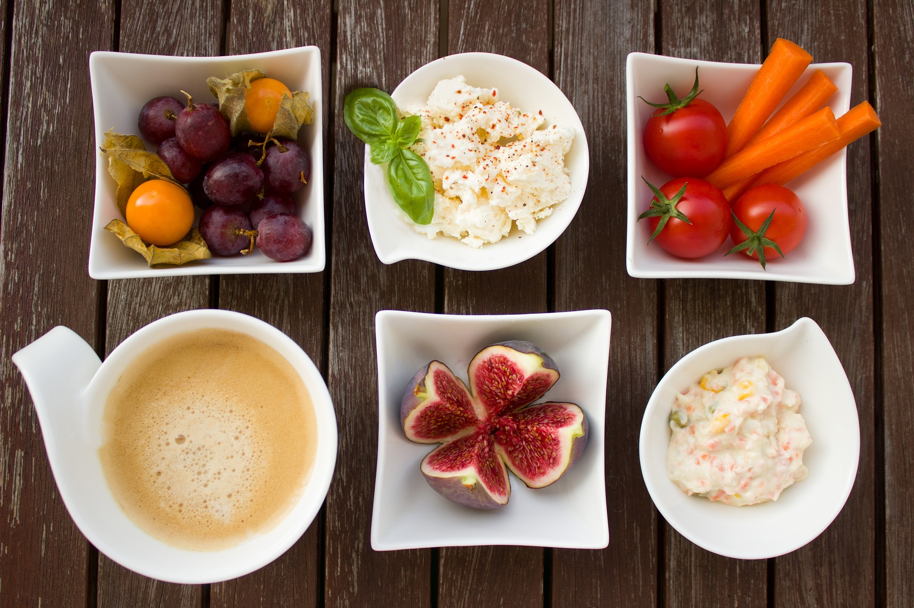

# Desayuno y media mañana

El **desayuno** es una de las comidas más importantes del día. Debe proporcionar aproximadamente un 25% de la energía diaria. Es muy saludable comenzar el día tomando un buen desayuno. El desayuno ideal incluye al menos tres alimentos distintos: leche o derivado lácteo, fruta o zumo de fruta y pan o cereales. Es aconsejable dedicar el tiempo necesario (por lo menos 15 minutos) y sentarse a la mesa relajado y en compañía de la familia, siempre que sea posible, antes de empezar la jornada. Desayunar bien todos los días permite una mayor concentración en las actividades diarias (clases, trabajo, etc.) y proporciona vitalidad y energía. La supresión del desayuno suele acarrear, en cambio, sensación de agotamiento durante toda la mañana.

A **media mañana** se puede tomar algo también, especialmente si el desayuno no ha sido lo suficientemente abundante. Lo más adecuado es una fruta o zumo natural, o algún lácteo. Es aconsejable tomar bollos y dulces sólo de forma ocasional, una vez a la semana, por ejemplo, lo mismo que las latas de refrescos y las bolsas de patatas fritas y similares.

Fuente: [Pixabay](https://pixabay.com/es/desayuno-hortalizas-caf%C3%A9-higo-1822190/)