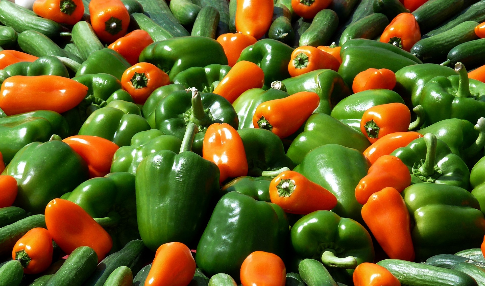

# El vegetarianismo y la dieta vegetariana

La _dieta vegetariana_ merece especial atención porque es uno de los **mejores ejemplos de la confusión que se crea cuando se mezclan conceptos**. Como hoy conocemos, para satisfacer adecuadamente las necesidades nutritivas del hombre, la dieta debe contener alimentos de distintas características, representativos de cada uno de los diez grupos principales de alimentos habituales. Por tanto, toda dieta que prescinda de un grupo de alimentos, como son los alimentos de origen animal, debe considerarse con reservas.

La **limitación principal de la dieta vegetariana es la menor calidad de la fuente de proteína**, es decir, de la proteína vegetal, así como la **ausencia de vitamina B12 en los alimentos vegetales**. Recordemos, en este sentido, que las proteínas de origen vegetal contienen generalmente una menor proporción de algunos de los aminoácidos indispensables para nuestra nutrición que las proteínas de origen animal. Afortunadamente, gracias al fenómeno de la suplementación es posible obtener mezclas de proteínas distintas que se comportan como una proteína de buena calidad, desde el punto de vista nutritivo. La adición de proteínas de buena calidad, como las de la leche y el huevo, a una dieta vegetariana, transforma a ésta en una dieta satisfactoria.Por otro lado, el problema de la ausencia de vitamina B12 en la dieta vegetariana estricta no resulta menos importante, ya que esta vitamina es indispensable para el hombre, ocasionando su carencia anemia perniciosa y graves alteraciones del sistema nervioso. Pues bien, esta vitamina no está presente en los vegetales. 

Fuente de la imagen: [Pixabay](https://pixabay.com/es/paprika-hortalizas-alimentos-537632/). Dominio Público