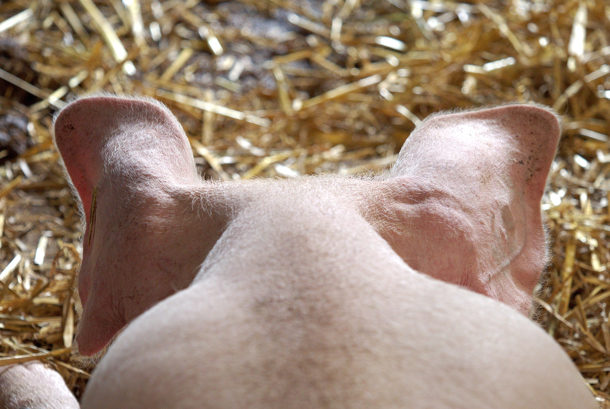

# ¿Es malo el cerdo?

Mucho se ha escrito sobre las desventajas de comer cerdo desde el punto de vista nutricional. Sin embargo, la carne de cerdo es una de las más magras, aunque también es cierto que muchos productos derivados del cerdo, como el chorizo, salchichón o el tocino, sí tienen un alto contenido en grasa saturada, cuyo consumo excesivo se ha asociado con altos niveles de colesterol, endurecimiento de las arterias, etc. Ello ha supuesto que **mucha gente suponga -erróneamente- que todo el cerdo es rico en grasas**, y en consecuencia incompatible con una alimentación saludable. Por ello, es necesario recordar que la carne de cerdo magra **tiene menos grasa que la de vaca o de cordero**, y no tiene  mucha más que el pollo sin la piel. Así, como ejemplo, una porción de 100 gramos de pierna magra de cerdo asada contiene un 7% de grasa, mientras que una porción equivalente de pollo sin piel contiene un 5.5% de grasa. Por otro lado, en términos de proteínas y de aporte de calorías, hay poca diferencia entre las carnes, ya que  continuando con el ejemplo del pollo frente al cerdo, la de este último contiene 30 g de proteínas y unas 180 kcal, mientras que la del pollo contiene 25 g de proteína y 150 kcal. Además, la carne de cerdo puede resultar una buena fuente de vitaminas del complejo B, especialmente de vitamina B12 o cianocobalamina, así como de minerales, como hierro y cinc.

Una forma muy popular de tomar la carne de cerdo es curada (jamón). El problema es que alimentos como el jamón o el tocino van a tener un elevado contenido en sodio, por lo que aquellas personas con problemas de hipertensión arterial deberán tenerlo en cuenta.

Fuente: [Pixabay](https://pixabay.com/es/cerdo-orejas-la-cabeza-animales-1639583/). Dominio público