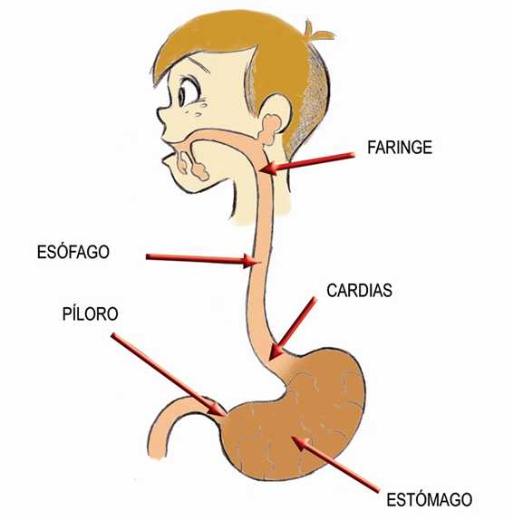

# Esófago y estómago

El **esófago** es un tubo musculoso y largo que va desde la base del cuello, atraviesa el tórax y el diafragma y se abre en el estómago, que está en el abdomen.

El **estómago**es una bolsa dilatada que recibe toda la comida; la puerta de entrada se llama cardias, y la de salida píloro. Las paredes del estómago tienen glándulas que segregan jugo gástrico. La forma del estómago depende de si está lleno o vacío, su posición también depende de si estamos de pie o tumbados, de lo altos o anchos que seamos, pero siempre está en el lado izquierdo, parcialmente tapado por las costillas. Poco después de que el alimento llegue al estómago, comienza a segregarse jugo gástrico copiosamente, y la pared del estómago comienza con contracciones regulares o movimientos peristálticos para producir una mejor mezcla de los jugos con los alimentos para formar el quimo.

A intervalos regulares se produce el paso del quimo al duodeno. Este hecho se denomina **vaciado gástrico**, y su ritmo depende del tipo de comida que hayamos tomado: si era rica en hidratos de carbono, como la pasta, el ritmo es más rápido; por el contrario, si era rica en proteínas o grasa, como la carne, el ritmo se enlentece para dar más tiempo para digerir el quimo en el estómago. El olor de los alimentos, el sabor, incluso pensar en la comida, produce la respuesta del sistema nervioso autónomo, que comienza a segregar saliva, jugo gástrico y pancreático: este reflejo es involuntario, no controlable.

Banco de imágenes de la FEN. _Esófago y estómago_