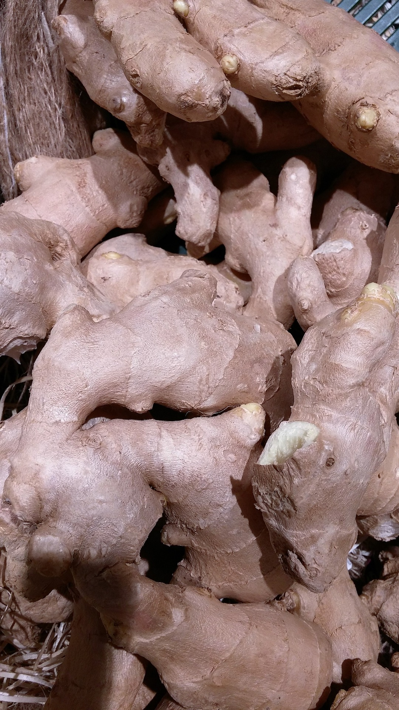

# ¿Está justificada la moda del ginseng y jalea real?

Recordemos que la jalea real es un líquido viscoso que sirve de alimento a la _abeja reina_. Por su parte, el llamado **ginseng** es una planta tradicional de la medicina oriental. Ambos productos han tenido un uso como suplementos tónicos o reconstituyentes. Para el ginseng se postulan un amplio número de “beneficios”: efecto antiestrés y antifatiga; disminución del colesterol; protección frente al cáncer, y un largo etcétera. Los **datos científicos para demostrar estas acciones son insuficientes, y sin embargo sí sabemos que el uso prolongado puede tener efectos negativos**.

La **jalea real** se parece más a un alimento...es el que producen para alimentar a las larvas destinadas a convertirse en reina. Esta abeja reina tendrá mayor tamaño, vivirá más tiempo, y tendrá una elevada capacidad reproductora. Pues bien, a raíz de estas acciones, se le han atribuido a la jalea real diversas acciones…reconstituyente, revitalizante, antifatiga, de protección frente a la arteriosclerosis, antianémica, etc. Lo que sí es cierto es que **es un alimento con una alta densidad de nutrientes, pero eso no significa que se le puedan atribuir poderes más allá de los nutritivos**.

Fuente: [Pixabay](https://pixabay.com/es/jengibre-ginseng-tee-asia-japon%C3%A9s-1614694/). Dominio público