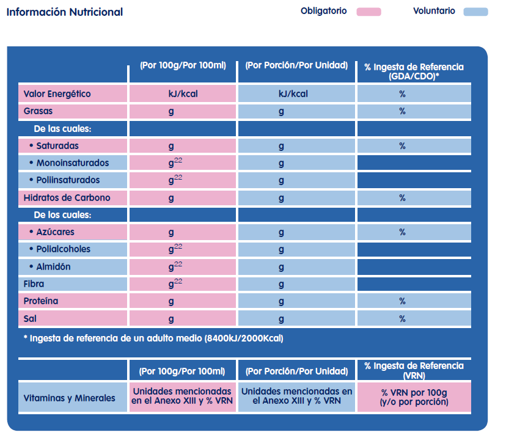

# Etiquetado nutricional

La información nutricional en los envases de alimentos es de **declaración obligatoria desde el 13 de diciembre de 2016.**

Los elementos a declarar de forma obligatoria son: **el valor energético y la cantidad de grasas, ácidos grasos saturados, hidratos de carbono, azúcares, proteínas y la sal**. Todos estos elementos deberán presentarse en el mismo campo visual. Además, podrá repetirse en el campo visual principal la información relativa al valor energético sólo o junto con las cantidades de grasas, ácidos grasos saturados, azúcares y sal. La declaración habrá de realizarse **obligatoriamente**  "**por 100 g o por 100 ml**" lo que permite la comparación entre productos, permitiendo además la decoración "**por porción**" de forma adicional y con carácter **voluntario**. 

El contenido de la información nutricional obligatoria podrá **completarse con** la indicación de una o varias de las siguientes sustancias:

*   Ácidos grasos monoinstaurados
*   Ácidos grasos poliinsaturados
*   Polialcoholes
*   Almidón
*   Fibra alimentaria
*   Cualquier vitamina o mineral que se encuentre en cantidades significativas

Otra forma de expresar la información nutricional es a través de los **porcentajes de ingestas de referencia (GDOs o CDAs)** que son los niveles típicos de ingesta de nutrientes que la mayoría de la gente sigue para consumir diariamente una dieta saludable. En el caso de que se proporcionen las ingestas diarias de referencia (GDAs/CDOs), la siguiente declaración deberá situarse al lado de las ingestas diarias de referencia (GDAs/CDOs): «Ingesta de referencia de un adulto medio (8400kJ /2000kcal)». Los % de GDAs/CDOs junto con la información nutricional proporcionan una guía para ayudar a la gente a entender la cantidad aproximada de valor energético y las cantidades de grasa, ácidos grasos saturados, hidratos de carbono, azúcares, proteínas y sal que se pueden consumir diariamente como parte de una dieta saludable. **Los GDAs/CDOs son menciones voluntarias en el etiquetado**.

<table class="exe-clear" style="border: 0px solid #2e4cd0;" border="0" align="center"><caption><strong>Ingestas de referencia diarias</strong></caption>
<tbody>
<tr>
<td>Valor energético o nutriente</td>
<td>Ingesta de referencia</td>
</tr>
<tr>
<td>Valor energético</td>
<td>8400kj/2000kcal</td>
</tr>
<tr>
<td>Grasas totales</td>
<td>70 g</td>
</tr>
<tr>
<td>Ácidos grasos saturados</td>
<td>20 g</td>
</tr>
<tr>
<td>Hidratos de carbono</td>
<td>260 g</td>
</tr>
<tr>
<td>Azúcares</td>
<td>90 g</td>
</tr>
<tr>
<td>Proteínas</td>
<td>50 g</td>
</tr>
<tr>
<td>Sal</td>
<td>6 g</td>
</tr>
</tbody>
</table>

Como **resumen a la información facilitada,** se incluye un cuadro con las menciones obligatorias y voluntarias en cuanto a la información nutricional:

FIAB (2014) [Guía sobre la información alimentaria facilitada al consumidor](http://www.fiab.es/archivos/documentoMenu/documentomenu_20140320162214.pdf). Reglamento UE 1169/2011.Marzo 2014.

Banco de imágenes de la FEN. _Información nutricional obligatoria y opcional_ (Todos los derechos reservados)

https://youtu.be/MKsmXL4xG5c