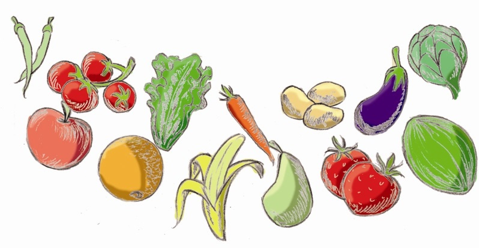

# Frutas, verduras y hortalizas

Las **frutas, verduras y hortalizas** son alimentos con una gran riqueza en vitaminas y minerales; por ello, es muy conveniente saber las pérdidas de estos nutrientes que se producen al aplicarles distintas técnicas de conservación y/o procesado de las mismas.

*   **Pérdidas en la recolección**
    

Dado que hay muchas vitaminas que actúan como cofactores de enzimas, cuando éstas se destruyen también lo hacen las vitaminas, con lo cual hay una pérdida de vitaminas después de la recolección.

*   **Pérdidas en el procesamiento**
    

Los vegetales son sometidos a pelado, troceado y otras muchas operaciones, que suponen una pérdida de nutrientes. Es típico, no sólo en la industria sino en el propio hogar, quitar la piel de las frutas y las hojas externas de las verduras. Pues bien, se ha visto que la cantidad de vitamina C es mayor en la piel que en el resto de la manzana, al igual que sucede en el corazón de la piña. Otro ejemplo es la epidermis de la zanahoria, que tiene más cantidad de niacina que el resto.

*   **Pérdidas en el lavado**
    

La mayor pérdida de nutrientes se produce cuando se lavan los trozos cortados de las verduras y hortalizas. En la industria se les suele hacer lavados, se les transporta por arrastre con líquidos, se escaldan y se cuecen.

*   **Adición de sustancias químicas para la conservación de los alimentos**
    

Los agentes oxidantes destruyen las vitaminas A, C y E. El anhídrido sulfuroso (es un gas) se usa para prevenir el pardeamiento enzimático de las frutas y hortalizas: protege la vitamina C, pero destruye la vitamina B1 o tiamina.

*   **Pérdidas en el almacenamiento**
    

Tanto las frutas como las hortalizas no son atacadas por bacterias sino por mohos, sobre todo si tienen algún tejido dañado (si ha sufrido un golpe, un corte...). Se ablandan, se producen olores extraños y, desde el punto de vista nutricional, se destruyen vitaminas.

Las frutas, como por ejemplo las fresas, que tienen la piel muy delicada, incluso el lavado les produce lesiones por roces con lo cual pueden ser atacadas por los mohos. Por tanto, no conviene lavarlas hasta que se vayan a consumir.

Banco de imágenes de la FEN. _Frutas, verduras y hortalizas_ (Todos los derechos reservados)

*   **Pérdidas en la refrigeración**
    

Se produce por la desecación de las células de las verduras y hortalizas; entonces se concentran las enzimas de dentro de las células y se rompen las paredes, con lo cual salen al exterior y se produce podredumbre. No sólo hay que refrigerar sino también procurar que estén en un ambiente húmedo

*   **Pérdidas en el enlatado**

Primero se llenan las latas, se elimina el aire y se pasteurizan, con lo cual en ausencia de oxígeno y por el tratamiento térmico se pueden dar transformaciones, sobre todo de ciertas vitaminas, como la A y la E.

Especial atención requieren las verduras y hortalizas en lata porque pueden llevar la bacteria _Clostridium botulinum_, que tiene esporas (forma de resistencia de la bacteria) que resisten hasta 5 horas a 100º C, con lo cual la pasteurización no las elimina y producen una neurotoxina que da lugar al botulismo. La ventaja es que esta neurotoxina sí se destruye por el calor, por lo que es conveniente cocer el contenido de una lata de hortalizas antes de consumirlo.

*   **Pardeamiento enzimático**
    

Hay unas reacciones de pardeamiento que son de tipo enzimático (necesitan oxígeno); por ejemplo, es lo que ocurre en las manzanas, plátanos, peras e incluso en la lechuga, una vez cortados y no está relacionado con los hidratos de carbono (al contrario del pardeamiento no enzimático -descrito anteriormente- o reacción de Maillard).