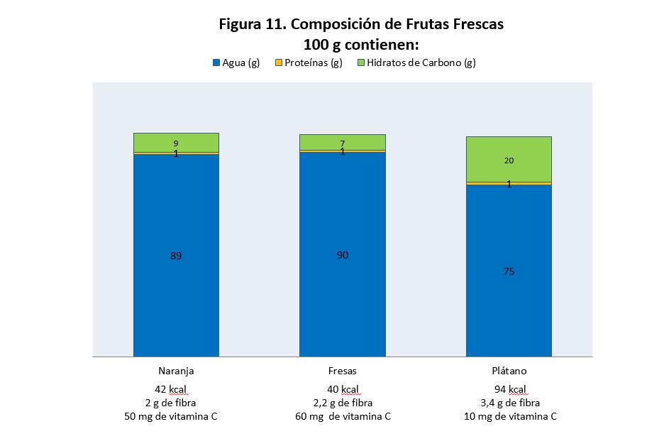
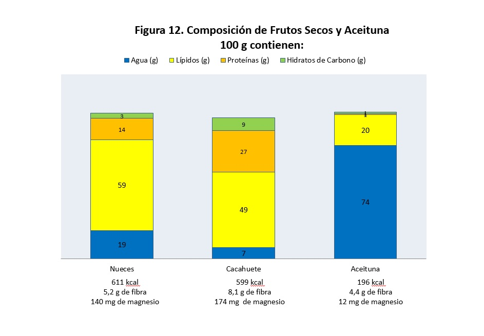

# Frutas y frutos secos

Las frutas son un grupo de alimentos con una **c****omposición nutricional muy similar a las verduras, pero con una cantidad superior de hidratos de carbono simples (azúcares).** El agua es el componente mayoritario, llegando a alcanzar más del 90% de la composición en el caso de las frutas frescas, aunque su contenido es mucho menor en  las desecadas o en los frutos secos. Junto con las verduras y hortalizas, las frutas son las principales fuentes de agua, fibra, vitaminas y minerales. Constituyen también la fuente alimentaria más importante de vitamina C (Figura 11).

Banco de imágenes de la FEN. _Composición de las frutas frescas_

Las frutas son los frutos, infrutescencias, semillas o partes carnosas de órganos florales de plantas plurianuales, cultivadas o no. Deben haber alcanzado un grado de maduración adecuado para ser aptas para el consumo humano. Se diferencian de las hortalizas y verduras en que éstas proceden de distintas partes de las plantas herbáceas, mientras que las frutas sólo proceden de partes localizadas de las plantas leñosas.

Las frutas pueden ser de diferentes tipos:

*   **Frutas carnosas**: su contenido en agua está por encima del 50%. Son de textura blanda, azucaradas y aromáticas. Ejemplos: la **[naranja](45-naranja.pdf "Naranja")**, la **[pera](46-pera.pdf "Pera")**, la **[manzana](47-manzana.pdf "Manzana")**, el **[melocotón](48-melocoton.pdf "Melocotón")**, las **[fresas](49-fresa.pdf "Fresa")** o el **[plátano](50-platano.pdf "Plátano")**.
*   **Frutas secas**: su contenido en agua está por debajo del 50%. Son las que se conocen como _frutos secos_. Ejemplos: la **[almendra](51-almendra.pdf "Almendra")**, las **[nueces](52-nuez.pdf "Nuez")** y las **[avellanas](53-avellana.pdf "Avellana")**.
*   **Frutas oleaginosas**: su contenido en grasa es elevado, por lo que a veces son empleadas para la obtención de aceites y mantecas. Ejemplos: la **[aceituna](54-aceitunas.pdf "Aceituna")**, el **[cacahuete](55-cacahuete.pdf "Cacahuete")**, el **[coco](56-coco.pdf "Coco")** y la **[pipa de girasol](57-pipasgirasol.pdf "Pipas de girasol")**.

Los frutos secos, al contener muy poca agua, son una **excelente fuente de energía, fibra y minerales**. En los frutos oleaginosos, como la aceituna, el contenido en lípidos y, por tanto, en energía, es mucho más alto que en las frutas carnosas (Figura 12).

Banco de imágenes de la FEN. _Composición de frutos secos y aceituna_