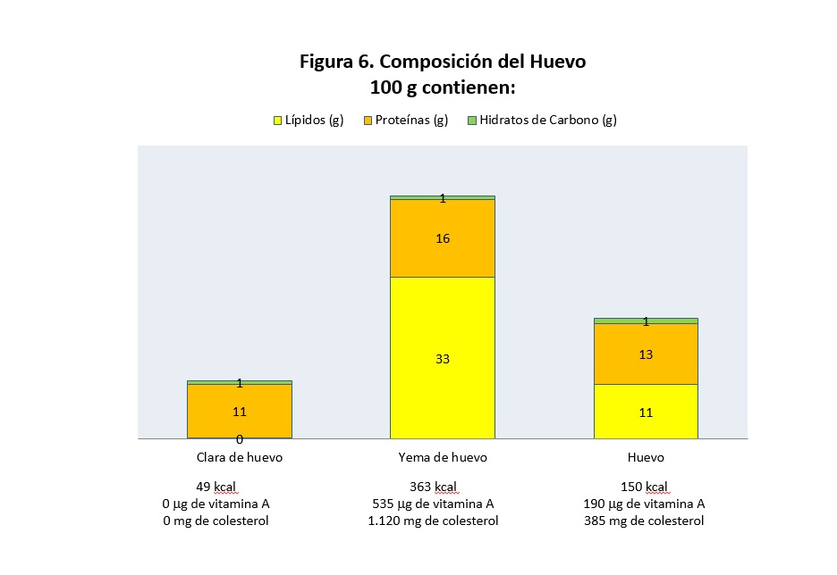

# Huevos

Nutricionalmente, los huevos son considerados **alimentos de gran valor**, ya que son fuente de casi todos los nutrientes (excepto hidratos de carbono, fibra y vitamina C), sus proteínas son consideradas las de mayor valor biológico, aunque es cierto que contienen una importante cantidad de colesterol.

Todas las aves ponen huevos y casi todos son comestibles, pero los más consumidos son los **[huevos de gallina](23-huevos.pdf "Huevos")**. El huevo no debe consumirse crudo, ya que, puede provocar problemas de salud. Los huevos también son alimentos **muy perecederos**. En la clara se encuentran las proteínas y las vitaminas hidrosolubles y en la yema se concentran las grasas, el colesterol y vitaminas liposolubles como la vitamina A (Figura 6).

Banco de imágenes de la FEN. _Composición del huevo_