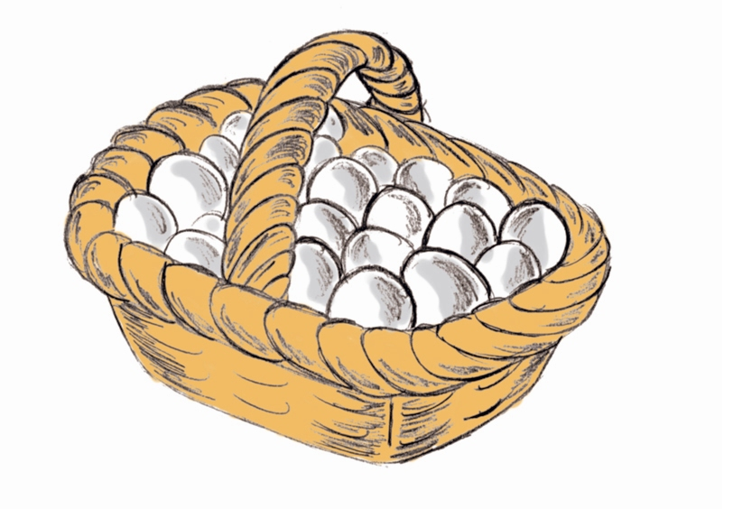
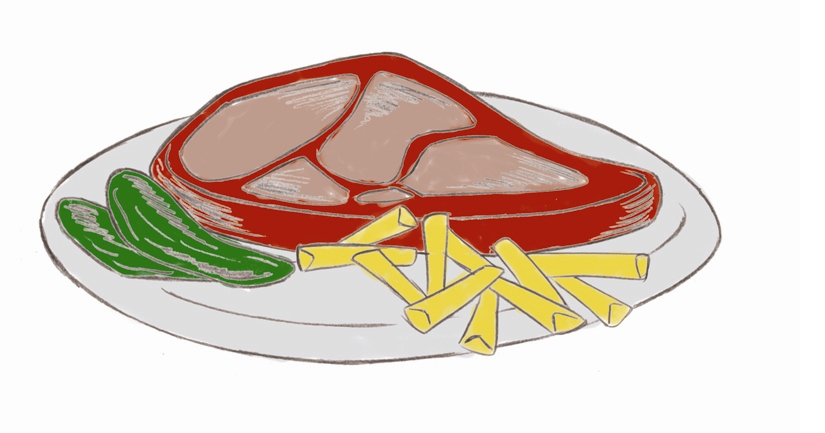

# Huevos y carne

Cuando se hierve un **huevo**, las proteínas de la clara se hacen rígidas y se coagulan; se dice que las proteínas se han desnaturalizado (han perdido su forma nativa) pero esto no cambia su composición. Los aminoácidos son los mismos, lo que cambia es la estructura, por lo que el huevo cocido tiene similar valor nutritivo que el crudo. Cuando los adquirimos, la cáscara debe estar intacta (sin roturas) y limpia. Una forma de comprobar si el huevo está fresco o no es el tamaño de la cámara de aire. Esta cámara está en el extremo más ancho del huevo, y cuando son frescos es pequeña (como mucho 9 mm.). Otra forma de saberlo es cuando cascamos el huevo: la clara y la yema deben ser firmes y la yema estar centrada sobre la clara, que deberá estar poco extendida.

Banco de imágenes de la FEN. _Cesta con huevos_ (Todos los derechos reservados)

En el caso de la **carne**, al sacrificar el animal hay que tener en cuenta que con el rigor mortis la musculatura se habrá quedado acortada y endurecida; por eso es necesario esperar unos días, colgando la carne en un lugar frío y seco. De esta manera el rigor va desapareciendo y comienza la maduración en la cual la carne queda más blanda.Para comprobar la calidad hay que fijarse en su aspecto externo, en la consistencia y en el color. La carne de buena calidad tiene la superficie tersa, consistencia firme y elástica y está ligeramente húmeda. La carne dura, poco flexible y seca, es porque ha estado almacenada mucho tiempo o que el animal era viejo. En cuanto al color, varía según la carne y las piezas pero si hay oscurecimiento e irisaciones verdosas es que hay una alteración producida por microorganismos.

La carne picada se contamina antes (ofrece más superficie de contacto con el exterior). La carne de ave (pollo, pavo...) tiene muchas bacterias y también se contamina fácilmente.Las aves que están en mal estado tienen reflejos verdosos alrededor del cuello y el extremo de las alas oscuro. También la piel pegajosa y los olores extraños son una muestra de la alteración.

**¿Cómo se cocina la carne?**

Cuando cocinamos la carne, la sometemos a un aumento de calor, se produce un cambio irreversible, obteniéndose un alimento más palatable y digestible:

*   Su aroma es más apetecible
*   Su aspecto también mejora.
*   Se modifica la estructura, de manera que se facilita tanto la masticación como la digestión.
*   Se destruyen los microorganismos o al menos se inhibe su crecimiento.

Características que cambian en la carne al cocinarse:

*   No debe utilizarse sal en la carne antes de cocinarla porque aumentan los iones Na+ y Cl- de las células y esto inactiva las enzimas cárnicas, con lo que el alimento se endurece algo.
*   Si se fríe en aceite, la temperatura de éste no debe superar los 170º C (a partir de esta temperatura emite humo).
*   Cuando se reboza la carne con harina, con huevo o de otra manera, conviene que la temperatura del aceite sea alta porque coagula y fija las proteínas del rebozo, impidiendo el paso del aceite al interior.
*   En el asado al horno a temperaturas muy superiores a los 100º C se produce la denominada reacción de Maillard (pardeamiento) entre las proteínas, azúcares de la guarnición y grasas; primero se obtiene un producto que luego se rompe en otros más pequeños dando la coloración marrón y aroma típico de asado.
*   Los azúcares, en concreto, sufren un proceso de caramelización dando lugar a sustancias volátiles y productos que le dan el color marrón; por eso, a veces a la carne se le añaden líquidos azucarados.
*   A veces se les adiciona ácido cítrico (zumo de limón) o acético (vinagre), que rompen la sacarosa en sus componentes (glucosa y fructosa), que a su vez reaccionan más fácilmente con los aminoácidos dándose más rápidamente la reacción de pardeamiento.
*   Cuanto más viejo es un animal y más ha trabajado, más fuerte, duro, fibroso y abundante es el tejido conectivo (tejido que rodea a las fibras musculares); éste junto con los tendones (los que unen el músculo al hueso) necesita una cocción lenta y prolongada para ablandarse y convertirse en gelatina. La gelatina posee bastante valor nutritivo pero carece de triptófano, un aminoácido esencial y por tanto no es una proteína de alto valor biológico.

Banco de imágenes de la FEN. _Plato de carne con guarnición_ (Todos los derechos reservados)

**El curado de la carne**

Es una técnica que consiste en la adición a la carne de sal y nitrito sódico (o nitrato sódico); se puede añadir azúcar u otros ingredientes para mejorar el “flavor” (percepción de las cualidades de un alimento en el que intervienen todos los sentidos: olfato, gusto, vista, tacto y oído). La sal (cloruro sódico) inhibe el crecimiento de microorganismos (incluido el Clostridium botulinum).Durante el proceso de curado (sal o sal diluida en agua), debido a la gran cantidad de sal en el exterior (aumenta la presión osmótica porque el exterior tiene menos agua y más solutos), tiende a salir agua hacia el exterior y arrastra con ella las proteínas solubles de la carne. Después, la sal va hacia el interior, con lo que parte de la proteína que salió vuelve a entrar de nuevo y la carne se hincha. Se forma un complejo sal-proteína que fija el agua.La carne, al final, tiene más sales (que ha absorbido); en cambio, no se altera la calidad de las proteínas ni la estabilidad de las vitaminas del grupo B.