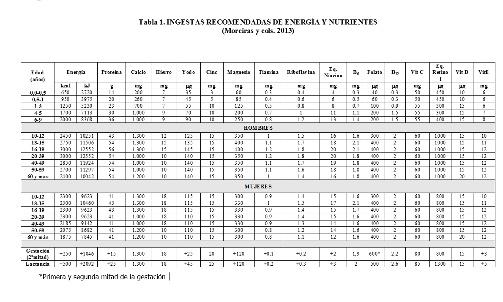

# ¿Qué tienen los alimentos?Energía y nutrientes

>**info**
>
># Objetivo del capítulo
>
>Profundizar en el conocimiento de los alimentos, en concreto, de su composición en nutrientes. 

___

>**tip**
>
># Concepto clave
>
>_Nutrientes:_ sustancias, orgánicas e inorgánicas, con una estructura química definida que, contenidas en los alimentos y bebidas, son indispensables para la salud y la actividad del organismo. Si no los consumimos en cantidad suficiente se cae en la enfermedad y, en algunos casos, si la ingesta es excesiva también. Por eso el equilibrio es importante.

**El ser humano para conservar su salud necesita consumir diariamente energía y unos 50 nutrientes**

Los **nutrientes** son sustancias, orgánicas e inorgánicas, con una estructura química definida que, contenidas en los alimentos y bebidas, son indispensables para la salud y la actividad del organismo, cumpliendo al menos uno de los siguientes fines básicos:

*   Proporcionar energía.
*   Aportar materiales para el crecimiento, la reparación y la reposición de los tejidos.
*   Modular las reacciones bioquímicas (metabólicas) que se producen en el organismo.

Se llaman **macronutrientes**, a aquellos que necesitamos en mayor cantidad (gramos/día): son los hidratos de carbono, los lípidos o grasas y las proteínas.

A los nutrientes que necesitamos en pequeñas cantidades (miligramos o microgramos/día) se les llama **micronutrientes** y a este grupo pertenecen los minerales y las vitaminas. Además está el agua. Actualmente, dentro de los nutrientes se incluye también la fibra.

**No existe ningún alimento completo**, es decir, que contenga todos los nutrientes en cantidad suficiente para cubrir las necesidades de una persona; la única **excepción** es la **leche materna de cada especie y sólo durante los primeros seis meses de vida** del recién nacido. Es, por lo tanto, de máxima importancia el consumo de una dieta variada que incluya todo tipo de alimentos que aporten los nutrientes necesarios.

Aparte de los nutrientes, en todo alimento podemos distinguir una **fracción no nutritiva** en la que se incluyen, además de los aditivos y contaminantes, otros compuestos naturales de diversa estructura y composición química, algunos de los cuales pueden desempeñar funciones importantes en la prevención de enfermedades muy graves, como las cardiovasculares o el cáncer. A estos compuestos funcionales se les da cada vez mayor importancia en nuestra dieta como factores preventivos de enfermedades crónicas. Ejemplo de ellos serían los fitoesteroles y  los antioxidantes.

Las necesidades de energía y de nutrientes son diferentes para cada individuo y dependen de distintos factores, como el sexo, edad, estado fisiológico (ej. gestación, lactancia), estado de salud y actividad física. Diferentes instituciones establecen recomendaciones para cubrir esas necesidades y esas cifras reciben el nombre de **Ingestas Recomendadas**.

Banco de imágenes de la FEN. _Ingestas recomendadas de energía y nutrientes_