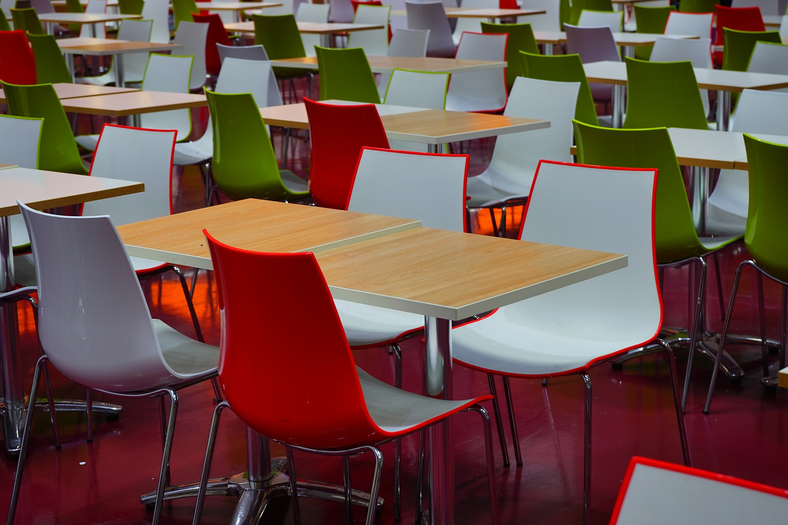

# Comedores escolares

# Objetivo del capítulo

Mostrar el comedor escolar como un lugar de aprendizaje continuo de hábitos alimentarios correctos y contribuir al descubrimiento de nuevos sabores.

Los **comedores colectivos**, entre los que se incluyen los escolares, han adquirido una gran importancia en los últimos años, debido a factores tan diferentes como pueden ser la incorporación de la mujer al trabajo o las ciudades que dificultan el poder realizar la comida principal del día en el hogar. En la actualidad, un niño puede comenzar a utilizar un comedor colectivo durante su estancia en una escuela infantil, continuar con el comedor del colegio, posteriormente el universitario, el de su lugar de trabajo y tras su jubilación, un comedor para personas de edad avanzada, es decir, puede necesitar este servicio durante toda su vida. Esto implica una **gran responsabilidad** por parte de estos servicios, ya que las comidas fuera del hogar influirán cada vez más en la dieta total del individuo, más en nuestro país donde la comida principal del día es la realizada al mediodía.

Si nos centramos en los comedores escolares, podemos observar que actualmente son una **necesidad para una gran parte de las familias**, ya que los horarios laborales y el ritmo de vida diario, no permiten una conciliación familiar. Es por tanto importante que las administraciones garanticen, supervisen y controlen su funcionamiento, facilitando el acceso a los mismos de la población infantil.Por otro lado, es necesaria la colaboración de los distintos centros de trabajo para facilitar horarios que permitan la conciliación familiar y con ello contribuir a aumentar el número de comidas realizadas en el seno del hogar.

  

Fuente: [Pixabay](https://pixabay.com/es/mesas-de-comedor-sillas-461863/). Dominio público

A esta situación socio-laboral, debemos añadir, lamentablemente, la situación actual de crisis que hace que haya un número elevado de niños malnutridos. España según un reciente informe de Cáritas es, después de Rumania, el segundo país de la UE con mayor índice de pobreza infantil. Este riesgo para niños menores de 18 años es del 29,9 % (9 puntos más que la media de la UE). Unido a esto la restauración colectiva ha sufrido un importante incremento en los pasados años, que se ha estabilizado y en algunos casos reducido por la situación económica que no permite afrontar el gasto de comedor a muchas familias. Por ello, una de las principales obligaciones de las administraciones públicas debe ser **garantizar la gratuidad y asistencia a los centros y a los comedores escolares de estos alumnos,** para los que en ocasiones la única comida del día es la realizada en el centro educativo, esto implica la necesidad de que el menú servido en estos comedores sea equilibrado y ajustado a las necesidades de los escolares.Más del 26 % de la población escolar, según datos del Ministerio de Educación, asisten a los comedores escolares, fundamentalmente durante la etapa de Educación Infantil y Primaria. Esta asistencia es superior en centros con titularidad privada. Una **alimentación insuficiente tiene unas repercusiones directas** en el desarrollo físico, psíquico y por tanto en el proceso de aprendizaje, por lo que es necesaria la planificación de menús equilibrados y saludables cuidando la calidad, variedad y cantidad adecuada a cada usuario.

Unido a esto, es sabido que **los escolares constituyen un colectivo muy vulnerable**, debido a las elevadas demandas fisiológicas que conlleva su crecimiento. Por otro lado,  **en esta etapa se van a consolidar unos hábitos alimentarios que correctos o no, casi con toda seguridad permanecerán en la edad adulta**. Por tanto, en estas etapas, no sólo se debe proporcionar un aporte adecuado de energía y nutrientes, para garantizar un buen estado nutricional, sino que se debe realizar una educación nutricional para que sus hábitos y comportamientos alimentarios perduren en el tiempo y se mantengan en la edad adulta. En este sentido, el comedor escolar desempeña una función educativa y debe servir para fomentar una dieta variada y equilibrada, así como fomentar la educación del gusto.

La educación debe facilitar el desarrollo individual de cada persona, aprovechando al máximo sus capacidades y proporcionándole los conocimientos, valores y hábitos que le permitan una integración y autonomía social.

**La** **Educación Infantil y Primaria son etapas complejas y base fundamental del posterior desarrollo del aprendizaje**. Los especialistas que la imparten, conocen muy bien las estrategias psicopedagógicas para la adquisición de hábitos, habilidades y conocimientos como mantener el orden, comunicarse, saber escuchar, vestirse, conocer su cuerpo y habituarse a los diferentes sabores y texturas de los alimentos, ya que el gusto no es innato y debe aprenderse durante la infancia. Además es en el colegio donde los niños y las niñas aprenden, por eso el comedor escolar se considera un lugar privilegiado para enseñarles buenos hábitos de vida y actitudes saludables, especialmente las relacionadas con la alimentación y la gastronomía.

Sabemos que los nutrientes se encuentran distribuidos en los diferentes alimentos, esto lejos de ser un problema debemos considerarlo como una ventaja, ya que un mismo nutriente la naturaleza nos lo oferta con diversas formas de sabores y colores que lo hacen más atractivo entretenido y apetecible. Este aprendizaje es fundamental ya que marcará los hábitos alimentarios de nuestros niños. Unos malos hábitos condicionarán su calidad de vida y también  su longevidad como explica la epigenética.