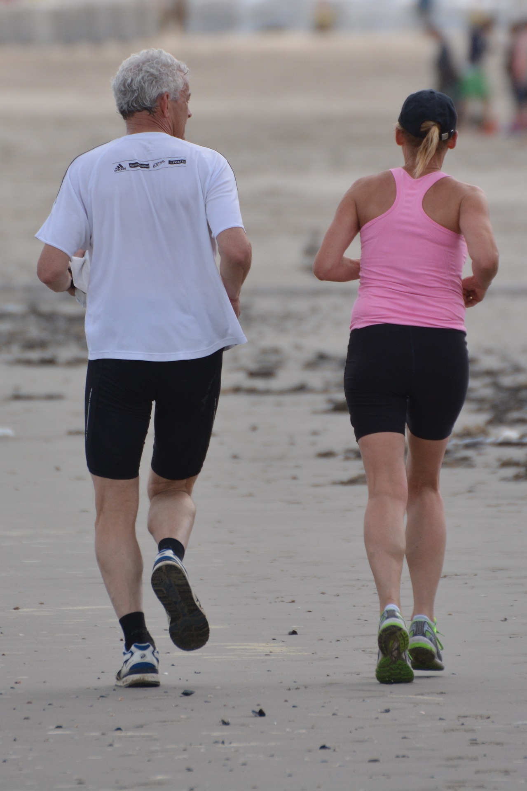
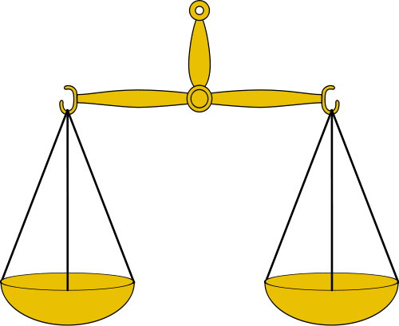

# Ejercicio físico y hábitos de vida

>**tip**
>
># Objetivo del capítulo
>
>Resaltar el ejercicio físico como un aspecto fundamental que siempre debe acompañar a la alimentación. Desarrollar de forma comprensible el concepto de energía. Presentar sugerencias óptimas para animar a realizar ejercicio.

**La inactividad física es, junto con una alimentación inadecuada y el consumo de tabaco y alcohol, el factor de riesgo más importante en el desarrollo de enfermedades crónico degenerativas.**

  

Fuente: [Pixabay.](https://pixabay.com/es/personas-footing-hombre-mujer-863728/) Dominio público

A su vez, el **balance entre las necesidades de energía y la ingesta calórica real** es el principal determinante del peso corporal. El gasto energético de un individuo debe ser compensado con el valor calórico que aportan los alimentos y las bebidas de la dieta. Cuando la dieta aporta más energía de la que el individuo gasta, el exceso se almacena en forma de grasa dando lugar a sobrepeso y obesidad. 

Xavi García. Wikimedia Commons. _Balanza_ ([CC BY-SA](https://creativecommons.org/licenses/by-sa/3.0/es/))

https://youtu.be/k5Y9D37KmJo