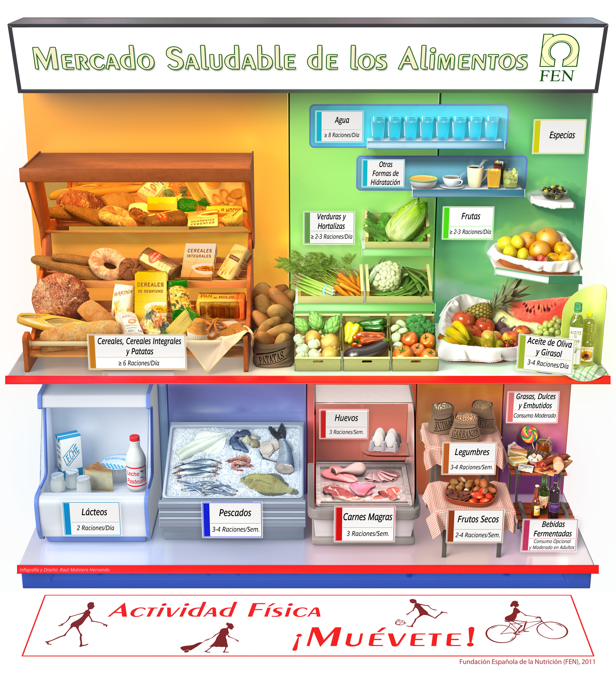

# ¿Cuánto debo comer?

>**tip**
>
># Objetivo
>
>Determinar qué, cuánto y cómo comer a lo largo de un día para asegurar una alimentación sana, completa y equilibrada. Para ello, el capítulo se divide en tres grandes bloques: primero, se introduce el Mercado Saludable de los Alimentos como representación gráfica; tras ello, se hablará de las raciones recomendadas de cada grupo de alimentos y, finalmente, se ofrecen recomendaciones nutricionales para mantener una dieta saludable a diario.

---

>**info**
>
># Concepto clave
>
>_Dieta_: conjunto de todos los alimentos que se ingieren habitualmente.

En las sociedades desarrolladas, como la nuestra, existe una creciente preocupación por la dieta y sus efectos sobre la salud. Continuamente nos preocupamos sobre los alimentos que comemos, las calorías que nos aportan, si son ricos en vitaminas o  minerales, si tienen fibra, si nos ayudarán a conseguir una mayor calidad de vida y a prevenir diferentes patologías... Vivimos en un momento y en una sociedad privilegiada por la gran abundancia de alimentos disponibles. Pero, paradójicamente, nos encontramos también con el problema de la elección de la dieta adecuada. Realmente, ¿cuánto debemos comer de cada alimento o grupo de alimentos? ¿Con cuánta frecuencia, para que nuestra dieta sea saludable?

La **dieta** es el conjunto de todos los alimentos que se ingieren habitualmente. Para que la dieta sea sana, es decir, variada, equilibrada y moderada, hay que comer todo tipo de alimentos y en las cantidades adecuadas, de modo que proporcionen la energía y todos los nutrientes en su justa medida. De todos los alimentos, algunos son básicos y deben aportar la mayor parte de la energía y nutrientes a la dieta, por lo que se deben tomar a diario. Otros alimentos, en cambio, se deben consumir con menos frecuencia, no a diario, sino con frecuencia semanal; por último, hay alimentos cuyo consumo debe ser ocasional. Todos los alimentos son importantes; por eso no hay ningún alimento bueno o malo: sólo hay dietas buenas o malas. Por lo mismo y dado que una dieta es, en pocas palabras, una combinación de alimentos, hay muchas posibles dietas saludables, no una sola.

**No hay ningún alimento bueno o malo: sólo hay dietas buenas o malas**

Los alimentos que se deben tomar cada día y sus cantidades están reflejados en el llamado **[Mercado Saludable de los Alimentos](http://www.fen.org.es/mercadoFen/mercadofen_ajus_General.html "Mercado Saludable de los Alimentos")** que ordena los grupos de alimentos de izquierda a derecha y de arriba a abajo, según la cantidad y frecuencia de consumo recomendado. Así, los alimentos situados por encima de la balda central, deben ser consumidos frecuentemente y a diario, mientras que, de los situados por debajo de dicha balda, se recomienda un menor consumo, ya sea de forma semanal u ocasional.

Fuente: [FEN](http://www.fen.org.es/mercadoFen/mercadofen_ajus_General.html)