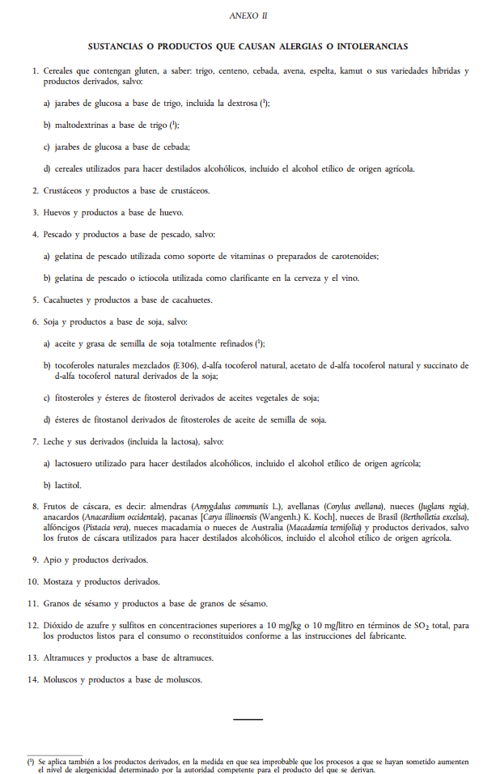

# Información de alérgenos

También se regula la **información relativa a los alérgenos** (sustancia que desencadena la formación de anticuerpos y puede causar una respuesta inmunológica), los cuales deberán aparecer indicados en la lista de ingredientes.

El listado de **sustancias o productos que causan alergias o intolerancias** se muestra en el Anexo II del Reglamento 1169/2011:

  

[Diario oficial de la Unión Europea](https://www.boe.es/doue/2011/304/L00018-00063.pdf). _Sustancias o productos que causan alergias o intolerancias_ (Dominio público)

La **referencia** a la sustancia deberá ser **clara**, mediante una composición tipográfica que la diferencie del resto, como por ejemplo:

*   Tipo de letra
*   Estilo
*   Color de fondo

Si **no hay lista de ingredientes** en el producto, la indicación de las menciones se hará mediante la palabra “**contiene**” seguida de la sustancia o producto presente en el anexo II.

Únicamente se estará **exento de indicar los alérgenos** en el caso de que la denominación del alimento haga referencia claramente a la sustancia o producto de que se trate (p.ej leche, bebida de soja, paté de atún,etc.)

**¿Qué ocurre con los alimentos sin envasar?**

El pasado 27 de marzo se aprobó el [**Real Decreto 126/2015**](https://www.boe.es/diario_boe/txt.php?id=BOE-A-2015-2293), de 27 de febrero, por el que se aprueba la norma general relativa a la información alimentaria de los alimentos que se presenten sin envasar para la venta al consumidor final y a las colectividades, de los envasados en los lugares de venta a petición del comprador, y de los envasados por los titulares del comercio al por menor.

Los **alimentos sin envasar** son aquellos que se presentan al consumidor final sin un envase o embalaje para su venta directa o consumo inmediato. Se incluyen dentro de esta definición los productos que se envasan en el momento de la compra a petición del consumidor final, así como los productos alimenticios que se sirven en bares, cafeterías y restaurantes. También se incluyen los alimentos que se suministran sin envasar a colectividades y los que se venden a granel al consumidor final.

Los **14** **alérgenos deberán ser indicados de forma obligatoria** en todos los establecimientos que se sirvan este tipo de alimentos.

Las distintas formas **propuestas** para su declaración son las siguientes:

*   En el propio menú o carta
*   En una pizarra o cartel próximo al alimento
*   Carteles que indiquen dónde se puede obtener esa información, bien de forma oral o bien de forma escrita.
*   De forma oral antes de terminar la venta.
*   Documentos en papel o en formato electrónico que puedan ser de fácil acceso tanto para el cliente como para el personal del establecimiento.

Conclusiones:

El etiquetado de alimentos proporciona de forma clara una información útil para todos los consumidores, facilitan un apoyo práctico a los consumidores para elaborar una dieta variada y equilibrada, dan oportunidad y capacidad de elegir las opciones más adecuadas para los consumidores, de acuerdo con sus propios estilos de vida. Es una tarjeta de presentación del producto de forma objetiva, clara y coherente, que no cataloga a los alimentos ni induce a interpretaciones erróneas sobre éstos.