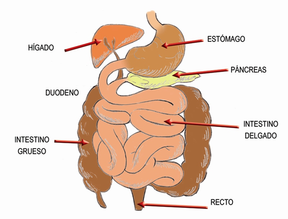

# Intestino delgado

El **intestino** es muy largo**,** puede llegar a medir hasta siete metros, por tanto, tiene que plegarse para caber en el abdomen. La mezcla de los alimentos con los jugos continúa, esta papilla sigue avanzando gracias a los movimientos peristálticos. Según su calibre, el intestino se divide en delgado o grueso.

El **intestino delgado** es más estrecho, y se divide en duodeno, yeyuno e íleon. Hay dos glándulas muy importantes para la digestión, que son el _hígado_y el _páncreas_, y que se abren en el duodeno.

El **hígado** es la glándula más grande del cuerpo humano, actúa como un filtro de toda la sangre venosa procedente del intestino antes de que pase a la circulación general. Esta sangre lleva los nutrientes, salvo las grasas. Está situado en el lado derecho, prácticamente tapado por las costillas. El hígado además, tiene otra función, que es la de fabricar bilis. La bilis son sales minerales que solubilizan las grasas y las dividen en partículas más pequeñas, y así facilitar la acción de otras enzimas. La bilis se está formando continuamente y se almacena en la vesícula biliar, desde donde se libera durante la digestión. El conducto de secreción del hígado se llama conducto hepático. El conducto de secreción de la vesícula se llama conducto cístico. Cuando se unen el cístico y el hepático se constituye el colédoco.

El **páncreas** es una glándula mixta, con una parte endocrina que produce dos hormonas, una llamada insulina, que regula el nivel de azúcar en sangre, y otra llamada glucagón, que regula el metabolismo de los hidratos de carbono. La mayor parte del páncreas funciona como una glándula exocrina que se abre al tubo digestivo, donde segrega el jugo pancreático. El conducto excretor se llama conducto pancreático, y se unirá al colédoco para desembocar los dos juntos en el duodeno. Además fabrica insulina, una hormona fundamental en el metabolismo de los azúcares.

Banco de imágenes de la FEN. _Intestino delgado y grueso_

En el intestino delgado se completa la digestión química de los alimentos y comienza una de las funciones más importantes del intestino delgado, que es la de **absorber los nutrientes**; para ello, tienen que atravesar la mucosa del intestino y pasar a la circulación sanguínea. Por ello, la mucosa del intestino delgado, sobre todo en el duodeno y la primera parte del yeyuno, se levanta y forma repliegues en forma de media luna; cada uno de estos repliegues soporta otros repliegues más pequeños de mucosa en forma de dedo de guante, formados por células llamadas _borde en cepillo_, pues tienen microvellosidades o pequeñas prolongaciones que consiguen aumentar enormemente la superficie interna de absorción, de tal forma que la superficie interna del corto tubo que representa el duodeno (unos 25-30 cm) se amplía a la superficie equivalente de una pista de tenis.

Al **finalizar la digestión**, el quimo se ha transformado en un líquido lechoso que ahora se llama **quilo**, que además de los nutrientes, lleva productos que no se digieren, como la fibra, pero que son muy importantes para el tránsito intestinal y la formación de heces. Algunas de estas fibras vegetales pueden fermentar en el intestino, sobre todo cuando se almacenan en el intestino grueso, produciendo gases intestinales. El aire entra en el tubo digestivo a través de la boca cuando tragamos; también pueden producirse gases por la fermentación de las bacterias intestinales en el ciego y el colon, y por la putrefacción de la comida si la digestión es lenta.

Una vez dentro, **los nutrientes pasarán al torrente sanguíneo y serán distribuidos a todas las células del organismo**. Las proteínas, hidratos de carbono, vitaminas, minerales y agua pasarán a los capilares sanguíneos que están en el interior de los dedos de guante que constituyen las microvellosidades. Todos estos vasos se reúnen en uno más grande que se denomina vena porta, que entra directamente en el hígado, y allí se ramificará nuevamente. Para llegar al circuito sanguíneo general, la sangre procedente del aparato digestivo a través de la vena porta, tendrá que pasar el filtro de las células hepáticas, cuyo metabolismo es sumamente complejo debido a la función de barrera que ejercen. Esta función también afecta a los patógenos, medicamentos u otras drogas que puedan absorberse a través del intestino. Las **grasas** cuando se absorben, pasan a los capilares linfáticos, eludiendo el filtro hepático, y **pasan a la sangre venosa directamente**.