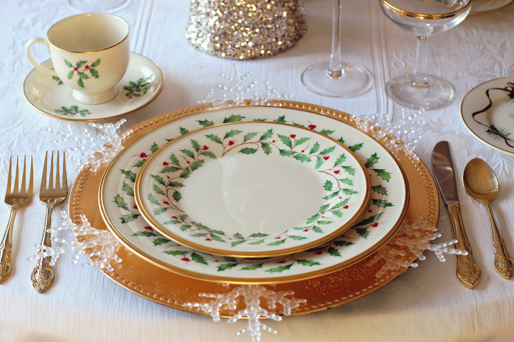

# La variedad es garantía de equilibrio

Cuanto **más variada sea la dieta** nos aseguramos que no nos va a faltar ningún nutriente de los que necesitamos, pero se pueden escoger los que más nos gustan de un mismo grupo, como veremos más adelante, y así disfrutar más de la comida.

Como dietas adecuadas, equilibradas o saludables (aquellas que contienen energía y todos los nutrientes en cantidad y calidad suficientes para mantener la salud) hay muchas, la elección de la más correcta según todos los condicionantes del individuo se convierte en un arte. Por eso hablamos de la Ciencia de la **Nutrición** y del Arte de la **Dietética**, en la que también interviene la **Gastronomía** o el arte de preparar con los alimentos elegidos una buena comida: equilibrada, apetecible y con buena digestibilidad. 

_"La Dietética, al igual que la pintura y la música, es un arte. El músico, con un número limitado de notas musicales, es capaz de crear infinitas melodías; el pintor, con su brocha y colores interpreta de mil formas el mundo y los sentimientos; el profesional de la Dietética plasma, de forma científica, creativa, con historia e innovación, múltiples combinaciones de alimentos y preparaciones que, al mismo tiempo que conducen a un mejor estado de salud, deleitan nuestros sentidos, de la misma manera que disfrutamos con la música, el color y las imágenes de la pintura" _(Beatriz Beltrán de Miguel, 2013).

El placer asociado a la alimentación debe seguir formando parte de nuestra cultura y de nuestro entorno social. En los niños una situación emocional adecuada ayuda a disfrutar más de la comida.

Fuente: [Pixabay](https://pixabay.com/es/mesa-de-navidad-cena-de-navidad-1926936/)

Los seres humanos somos los únicos animales que cocinamos los alimentos. Los otros animales se alimentan y nutren pero no llegan a convertir este momento en algo tan importante como es para nosotros el momento de la comida o la cena. Casi todo lo celebramos comiendo (una boda, un cumpleaños, etc.). Por tanto, debemos conocer muy bien los alimentos, saber qué contienen. Elegir los alimentos que formen parte de nuestra dieta es muy importante porque nos tienen que ayudar a:

*   Mantener una buena salud ahora.
*   Tener una buena salud en el futuro, ya que nos va a ayudar a prevenir las enfermedades crónicas degenerativas: enfermedades cardiovasculares, diabetes y ciertos tipos de cáncer.
*   Dar placer (que nos guste).
*   Encajar dentro de unos hábitos alimentarios (alimentos familiares, de la comunidad o del país) y costumbres.