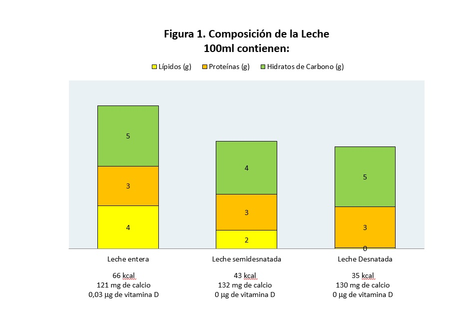
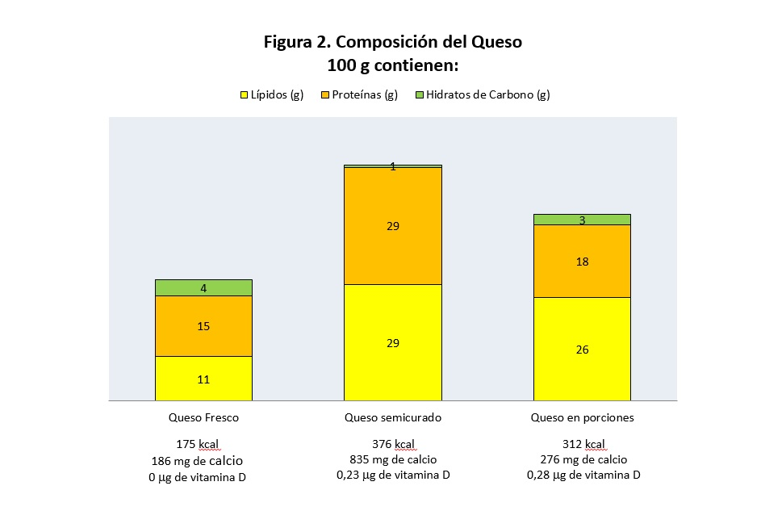

# Leche y derivados

El grupo de leche y derivados tiene unas magníficas propiedades nutricionales; los alimentos que lo componen son fuente de **vitaminas liposolubles y minerales (calcio)** y sus **proteínas** tienen un **alto valor biológico** por su contenido en aminoácidos esenciales.

La **[leche](1lecheentera.pdf "Leche entera")** es el producto de la secreción de las glándulas de las hembras mamíferas, cuya función natural es la alimentación de los recién nacidos. La que más consumimos es la leche de vaca. A partir de la leche podemos elaborar muchos derivados lácteos, como el yogur, los quesos, la cuajada, el requesón o la mantequilla.

La leche puede ser entera, con toda su grasa, semidesnatada, con 1,5 a 2% de grasa, o desnatada. Cuando desnatamos la leche perdemos gran parte de su contenido en vitaminas liposolubles (Figura 1).

Banco de imágenes de la FEN. _Composición de la leche_

El [**yogur**](2-yogur.pdf "Yogur") lo fabricamos añadiendo a la leche unos fermentos activos, es decir unas bacterias, que fermentan (se alimentan) la lactosa de la leche. La lactosa es el azúcar de la leche. Al consumir la lactosa liberan como producto de desecho ácido láctico y la acidez hace que **se coagule la proteína de la leche**, mayoritariamente constituida por caseína. Así hacemos que la leche adquiera la textura semisólida del yogur. A veces, cuando el yogur se deja un tiempo fuera de la nevera, al abrirlo vemos que se ha separado un líquido; es el suero láctico, es decir, la parte soluble de la leche, que lleva muchas proteínas disueltas.

El **[queso](3-quesomanchego.pdf "Queso")** lo podemos elaborar de muchas maneras, puesto que existen infinidad de quesos diferentes: frescos, blandos, semiduros, duros, más o menos curados, de vaca, oveja, cabra o sus mezclas. En síntesis, a la leche le añadimos unos microorganismos que fermentan la lactosa y unas enzimas que se llaman cuajo. Las enzimas son proteínas que son capaces de digerir, es decir, romper otras moléculas. El ácido láctico liberado por las bacterias y la acción del cuajo hace que coagule la proteína mayoritaria de la leche, la caseína. Luego se separa gran parte del agua de la leche y se deja al queso madurar. En un espacio a una temperatura y humedad reguladas, el queso descansa y los microorganismos crecen, produciendo, al alimentarse, nuevos sabores, colores y aromas. Así obtenemos los diferentes tipos de quesos. Su composición nutricional es parecida a la leche pero con menos agua y, por tanto, t**odo aparece más concentrado: grasa, proteína, calcio, vitaminas liposolubles** (Figura 2).

Banco de imágenes de la FEN. _Composición del queso_

No se sabe con certeza cuándo se empezó a elaborar queso pero se cree que fue en los fértiles valles de los ríos Tigris y Eúfrates hace unos 8.000 años. Antiguamente no existía la nevera ni los envases de plástico, así que el hombre utilizaba el estómago de algunos animales para guardar los alimentos. Probablemente el queso y los yogures surgieron accidentalmente al almacenar la leche en recipientes hechos con estómagos de rumiantes. La leche se mantenía templada y, horas después, se producía la coagulación de la misma, y si drenaba el suero, quedaba una masa compacta. La leche cambiaba de sabor, pero el producto en el que se transformaba, el queso, también estaba rico, no producía enfermedades y se conservaba durante mucho más tiempo. Transcurrido el tiempo, el hombre observaría que el extracto procedente del estómago de los rumiantes jóvenes era el responsable de la coagulación de la leche, lo que condujo a la preparación del cuajo para elaborar el queso de forma intencionada.

La [**cuajada**](4-cuajada.pdf "Cuajada") también se obtiene de la leche, se le añade el cuajo que se utiliza para la elaboración del queso se espera un poco y la leche coagula, adquiriendo una consistencia parecida a la del yogur. En la cuajada **no se añaden bacterias**. Es muy parecida en composición a la leche.

Para fabricar el **[requesón](5-requeson.pdf "Requesón"),** tomamos el agua que nos sobra al elaborar los quesos. La calentamos y le añadimos un poco de sal y se forman unos coágulos blanquecinos que llamamos requesón. Es un alimento formado fundamentalmente por la **proteína de la leche y calcio**.

La **[nata](6-nata.pdf "Nata")** es una leche que contiene mucha grasa (entre el 20 y el 40%). La mantequilla es la grasa de la leche.