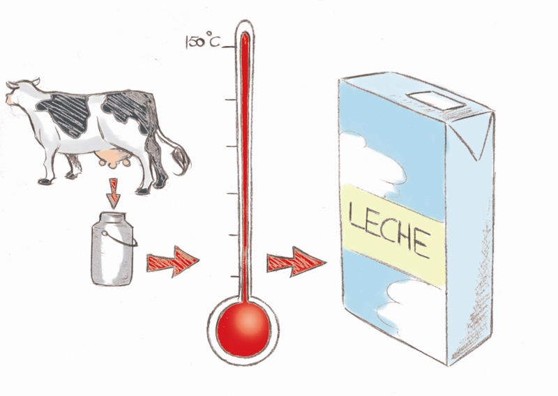
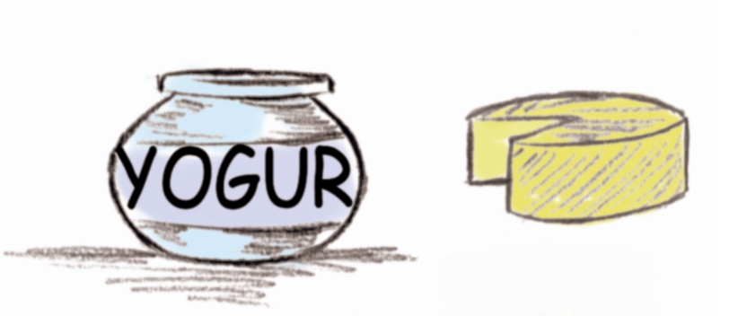

# Leche y productos lácteos

El primer tratamiento que sufre la **leche** es la homogenización, que consiste en disminuir el tamaño de los glóbulos de grasa. A continuación puede sufrir tratamientos térmicos, más o menos severos, para asegurar su conservación durante un periodo de tiempo que puede ser mayor (UHT, esterilización) o menor (pasteurización), en función de la intensidad de tratamiento que se aplique. También este tratamiento va a influir en la conservación, que requiere una temperatura menor de 5º C en el caso de la leche pasteurizada, la que menor tratamiento térmico ha sufrido.

La leche entera contiene las vitaminas liposolubles A y D. Como en la leche semidesnatada y desnatada el contenido graso es más bajo desaparecen la mayoría de las vitaminas liposolubles y por ello suelen añadirse dichas vitaminas en estos casos.Con la luz del sol, la vitamina B2 (riboflavina) reacciona con el aminoácido metionina originando un sabor desagradable; por eso conviene conservarla fresca y en la oscuridad, en el frigorífico o en envases que no dejen pasar la luz como es el caso de los de cartón, tipo tetrabrik.  

La leche condensada y la leche evaporada son aquellas en la que parte de su agua ha sido evaporada y luego se esteriliza. Tienen color amarillo y sabor parecido a la mantequilla debido al tratamiento térmico sufrido en el que se caramelizan parte de los azúcares. La leche condensada es también concentrada pero se le añade azúcar en una cantidad elevada lo que inhibe el crecimiento bacteriano; por eso no se esteriliza. La leche en polvo se elabora nebulizando (convirtiéndolo en polvo) la leche en una cámara con aire seco a unos 120º C.

Banco de imágenes de la FEN. _La leche y su tratamiento_ (Todos los derechos reservados)

Para el **yogur** se trata la leche con bacterias (_Lactobacillus bulgaricus_ y _Streptococcus thermophilus_), que acidifican y coagulan las proteínas de la leche (caseína sobre todo) y se forma la textura del yogur. Esto se hace a 40-45º C y luego se enfría a unos 5º C para parar la reacción de fermentación. Parte de la lactosa se transforma en ácido láctico, que es lo que le da al yogur su sabor ácido y actúa como conservante.También se comercializan _yogures termizados o pasteurizados después de la fermentación _a los que se les aplica un segundo tratamiento térmico (pasteurización) que garantiza su conservación durante un periodo de tiempo mayor y sin necesidad de mantenerlos refrigerados. 

Para el **queso**, una bacteria, la _Streptococcus lactis_, convierte la lactosa en ácido láctico, acidificando la leche, lo que ayuda a frenar el crecimiento de otros microorganismos. Las proteínas de la leche acidificada coagulan porque se les añade renina (que tiene una enzima.) La caseína coagulada forma un conglomerado con las gotitas de grasa y otras proteínas del suero. Después se separa el suero de la cuajada y a continuación se introduce en salmuera para eliminar todos los restos de proteínas del suero y el exceso de ácido láctico.El suero que separamos del queso contiene aproximadamente un 1% de albúmina, un 4% de lactosa, un poco de ácido cítrico y trazas de grasa, aminoácidos y vitaminas del grupo B. Las proteínas del suero en concentraciones del 20-80% se emplean en alimentos dietéticos, bebidas analcohólicas, productos horneados, embutidos y dulces.

Banco de imágenes de la FEN. _Yogur y queso_ (Todos los derechos reservados)