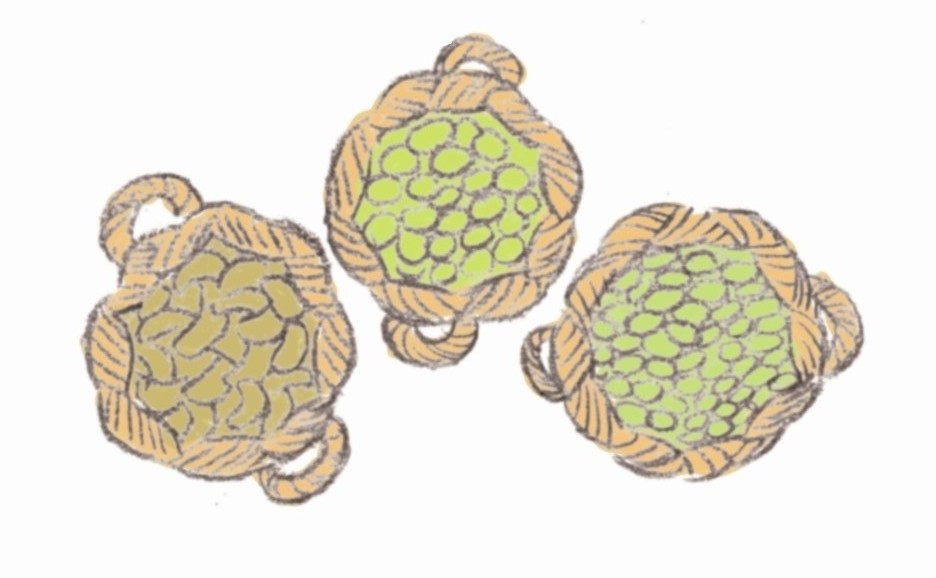
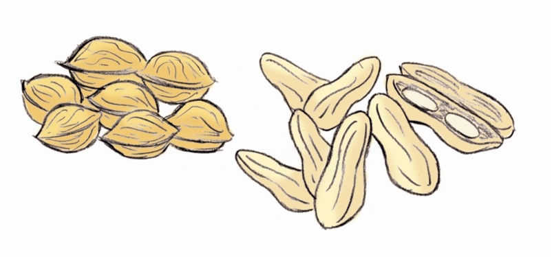

# Legumbres y frutos secos

El cocinado de las **legumbres** las hace más digestibles y las incorpora agua. Cuando se hierven, las paredes celulares de las células de las legumbres se ablandan y debilitan sus gránulos de almidón, se gelatinizan, poniéndose así más pastosas y agradables al paladar. Si se añade ácido ocurre lo contrario, es decir, se endurecen las paredes celulares.No obstante, conviene que no se rompan las paredes celulares, para evitar que las proteínas y vitaminas pasen al agua de cocción. Es aconsejable ponerlas 4 horas en remojo para disminuir su tiempo de cocción. Los garbanzos, en cambio, tienen que estar en remojo toda la noche. Las lentejas no es necesario ponerlas en remojo.

Banco de imágenes de la FEN. _Legumbres_ (Todos los derechos reservados)

**Frutos secos**

El _pardeamiento no oxidativo o reacción de Maillard_ se utiliza para obtener moléculas volátiles aromáticas y pigmentos en el tostado de los **frutos secos** (al igual que sucede en el café).También sufren enranciamiento, ya que tienen lípidos, que están expuestos a la oxidación. Como vimos anteriormente, el aire, la luz, el calor, los microorganismos y las enzimas degradan con el tiempo estos lípidos y dan lugar a moléculas más pequeñas de olor desagradable, (ácidos butírico, caproico y caprílico) responsables del sabor a rancio. 

Banco de imágenes de la FEN. _Nueces y cacahuetes_ (Todos los derechos reservados)