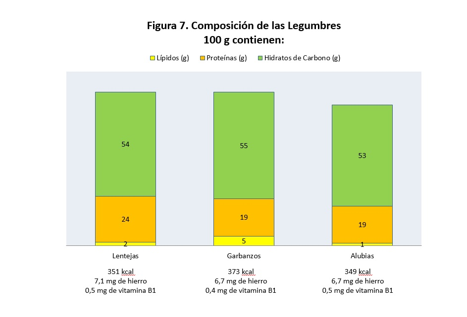

# Leguminosas

Las legumbres se encuentran entre los **primeros productos alimenticios cultivados por el hombre** y se consumen como semillas secas, limpias y separadas de la vaina. El grupo de las legumbres es fuente de proteínas de buena calidad, hidratos de carbono complejos, contiene una importante cantidad de fibra y poca cantidad de lípidos; también se puede destacar su contenido en minerales como calcio, magnesio, potasio, zinc o hierro y de casi todas las vitaminas, especialmente B1, B2 y folatos (Figura 7).

Banco de imágenes de la FEN. _Composición de las legumbres_  

En este grupo se incluyen alimentos como [garbanzos](http://www.fen.org.es/mercadoFen/pdfs/garbanzos.pdf "Garbanzos"), [judías](http://www.fen.org.es/mercadoFen/pdfs/alubias.pdf "Judías"), [lentejas](http://www.fen.org.es/mercadoFen/pdfs/lentejas.pdf "Lentejas"), [soja](http://www.fen.org.es/mercadoFen/pdfs/soja.pdf "Soja"), [habas](http://www.fen.org.es/mercadoFen/pdfs/habas.pdf "Habas"), [guisantes](http://www.fen.org.es/mercadoFen/pdfs/guisante.pdf "Guisantes"), etc. Las leguminosas son uno de los grandes protagonistas de la **dieta mediterránea tradicional**, y ha sido la base de numerosas recetas de nuestra cocina, de gran valor cultural, pero también nutricional.Como son semillas secas, se conservan durante mucho tiempo, pero es necesario cocerlas para que vuelvan a captar agua y adquieran una textura blanda y comestible.