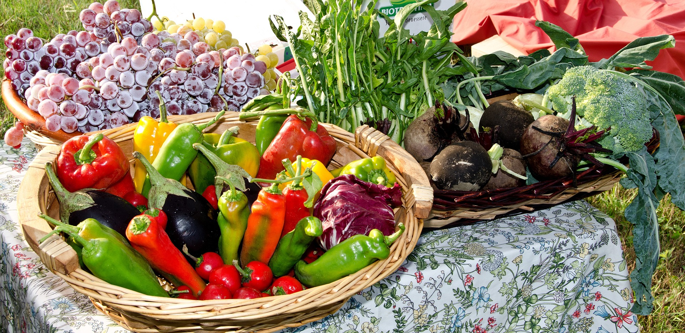

# Los valores que revela el color

De hecho, los **colores** de las **frutas y las verduras** nos pueden ayudar a comer sano, pues nos revelan importantes valores. Por ejemplo, el **verde** de las ensaladas es bueno para los huesos y los dientes y, en general, para que el cuerpo se defienda mejor de las enfermedades; y el **naranja** de la zanahoria y el melocotón, excelente para la vista y la piel. El blanco de, entre otros, la cebolla, el ajo, el nabo, el champiñón o el melón, es bueno para el corazón, mientras que el **rojo** de las cerezas, las fresas, la sandía, la granada o el tomate es también bueno para el corazón y para defenderse de las enfermedades. Finalmente, el **morado** de las uvas, las ciruelas, las berenjenas o la lombarda favorece tanto al cerebro como al corazón.

Y tan importante como el color es la **textura** de los alimentos, propiedad sensorial de todas las materias primas que es detectada por los sentidos del tacto, la vista y el oído y se manifiesta cuando el alimento sufre unas deformaciones.

Fuente: [Pixabay](https://pixabay.com/es/casas-rurales-de-alquiler-verduras-740179/)