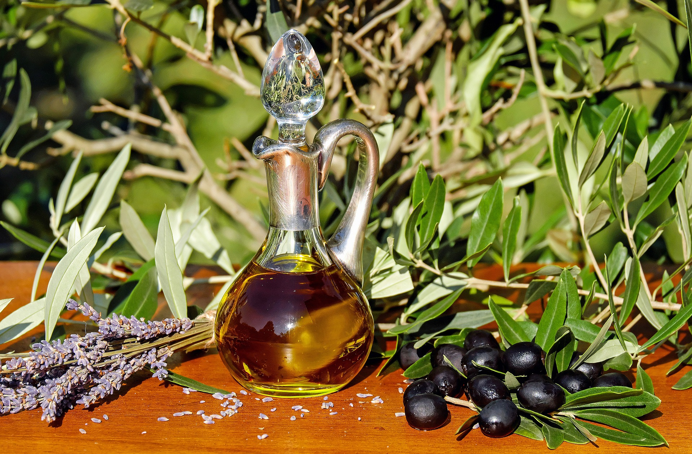
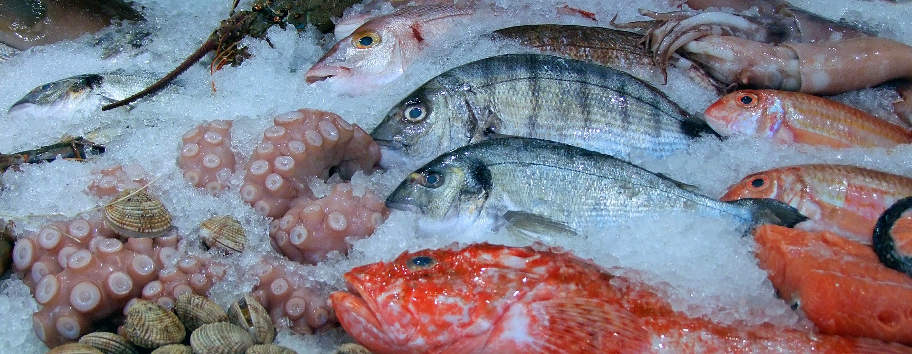

# Lípidos o grasas

Son cuantitativamente la **fuente más importante de energía** en nuestra dieta, ya que por cada gramo de grasa que absorbe el intestino se producen 9 kilocalorías. Además, la grasa constituye la **forma de almacenamiento** de la energía en nuestro cuerpo; sirve de vehículo de las vitaminas liposolubles (A, D, E, K), contribuye a dar sensación de saciedad y por lo tanto al control de la ingesta, y es uno de los principales responsables del sabor y el olor de los alimentos.

La grasa de los alimentos se encuentra en forma de **triglicéridos, colesterol y fosfolípidos**. Los **triglicéridos** nos aportan **ácidos grasos**, que pueden ser de tres tipos: saturados, monoinsaturados y poliinsaturados. Varios estudios han demostrado que la distinta proporción de estos tipos de ácidos grasos en la dieta influye de diferente manera en el riesgo de padecer enfermedades cardiovasculares, de manera que una mayor cantidad de ácidos grasos saturados aumenta el riesgo de padecer estas enfermedades y una mayor cantidad de ácidos grasos insaturados, en especial de monoinsaturados, la disminuyen.

Se recomienda que el porcentaje de energía que aporten los **ácidos grasos saturados** **no supere el 8 % de la energía total** consumida, que el de los **ácidos grasos poliinsaturados** se situé entre el **6-7%** y que entre el **15 y el 20 %** de la energía sea proporcionado por los **ácidos grasos monoinsaturados**. Estos porcentajes constituyen lo que denominamos el perfil lipídico de la dieta, que se utiliza como índice de calidad de la misma.

Las **grasas saturadas** se encuentran fundamentalmente en la carne de animales terrestres, tetrápodos (vaca, cerdo, cordero), en los huevos, la leche y en  los derivados de todos ellos.

  

Fuente: [Pixabay](https://pixabay.com/es/leche-huevo-comer-huevos-revueltos-1385530/)

  
El principal **ácido graso monoinsaturado** en nuestra dieta es el oleico, cuya principal fuente es el aceite de oliva.

  

Fuente: [Pixabay](https://pixabay.com/es/aceite-de-oliva-petr%C3%B3leo-alimentos-1596417/)

Por último, los **ácidos grasos poliinsaturados** son abundantes en los aceites de semillas (girasol, soja, maíz) y en el pescado. Con respecto a las grasas del pescado, hay que destacar también la riqueza de éstas en ácidos grasos omega-3, que tienen un efecto beneficioso adicional en la reducción del riesgo de enfermedades cardiovasculares. Favorecen la vasodilatación, son antinflamatorios y antiagregantes. Con todo ello, su ingesta mejora la circulación sanguínea y previene la aparición de placas de ateroma o de hipertensión.

  

Fuente: [Pixabay](https://pixabay.com/es/pescado-calamar-pulpo-mejillones-480830/)

El **colesterol** se encuentra únicamente en los alimentos de origen animal. La influencia del colesterol alimentario sobre las cifras de colesterol sanguíneo es muy pequeña; el que una persona tenga el colesterol alto o no depende mucho más de factores genéticos y de la cantidad de grasas saturadas que ingiera que de la cantidad de colesterol de su dieta.