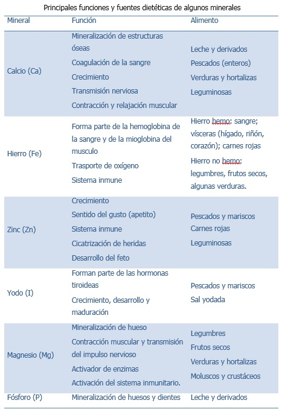

# Minerales

Al igual que las vitaminas, los minerales se necesitan en pequeñas cantidades pero su importancia para la salud es grande. Son **nutrientes reguladores**, que facilitan y controlan las diversas funciones del organismo, con el fin de que todos los procesos internos discurran con normalidad. Algunos minerales, como el calcio, el fósforo y el flúor tienen además una función estructural (forman parte de nuestros tejidos) ya que son necesarios para el crecimiento de huesos y dientes.

Se han descrito **20 minerales esenciales** para el hombre, entre los que destacan los siguientes: calcio, fósforo, magnesio, sodio, potasio, cloro, azufre, hierro, cinc, yodo, selenio, flúor, manganeso, cromo, cobre y molibdeno.

Una dieta variada aporta prácticamente todos los minerales que necesitamos en las cantidades adecuadas. Las frutas, las verduras, y sobre todo las legumbres y frutos secos son muy ricos en minerales. Los más difíciles de alcanzar sus recomendaciones son, quizás, el calcio y el hierro. Un buen aporte de calcio durante toda la vida, no únicamente durante la infancia, es imprescindible para una buena salud ósea. El **calcio**  tiene su mejor fuente alimentaria en la leche y sus derivados, pero también es abundante en los pescados que comemos con espinas, los frutos secos o las verduras de hoja verde. Actualmente también los cereales fortificados con este mineral pueden proporcionar una cantidad notable.

Otro mineral importante es el **hierro**_,_ cuya carencia es muy frecuente en la actualidad y da lugar a anemia. El hierro que nos aporta la carne y el pescado es de fácil absorción, pero el que procede de los vegetales, como las legumbres o las verduras de hoja verde (espinacas, acelgas), se absorbe y aprovecha peor. La ingesta conjunta de un alimento rico en hierro y un alimento rico en vitamina C ayuda a la absorción de este mineral (ej. un plato de lentejas acompañado, de postre por una naranja).

Es importante también hablar de otro mineral, el **sodio**. Elemento fundamental en el funcionamiento celular y el mantenimiento de la tensión arterial. Varios trabajos epidemiológicos demuestran que una ingesta elevada de sodio está relacionada con una mayor prevalencia de hipertensión que, a su vez, es factor de riesgo para la enfermedad cardiovascular. Los Objetivos Nutricionales de la Sociedad Española de Nutrición Comunitaria establecen que la ingesta de sodio no debe superar los 2400 mg/día, equivalente a 5 g sal/día. Los alimentos más ricos en sodio, en la dieta de los españoles, son los alimentos precocinados, junto con los embutidos, el pan y el queso. En España, el consumo medio de sal ronda los 10g/día, el doble de lo recomendado y sólo el 20% de esta cantidad procede del “salero”.  Es muy importante acostumbrarse a comer con poca sal desde edades muy tempranas, así como a leer las etiquetas nutricionales de los alimentos envasados, lo que nos ayudará a realizar una elección más saludable entre la gran disponibilidad de productos que nos ofrece el mercado.

Banco de imágenes de la FEN. _Principales funciones y fuentes dietéticas de algunos minerales_