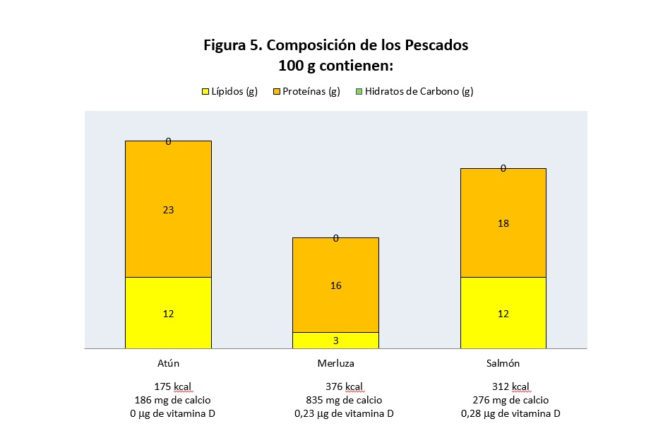

# Pescados y mariscos

En el grupo de los pescados se incluyen los animales vertebrados e invertebrados comestibles, marinos o de agua dulce que se capturan por el arte de la pesca. Entre los más consumidos en España encontramos **[merluza](16-merluza.pdf "Merluza"),****[lenguado](17-lenguado.pdf "Lenguado"), [pescadilla](18-pescadilla.pdf "Pescadilla"), [gallo](19-gallo.pdf "Gallo"), [salmón](20-salmon.pdf "Salmón"), [sardina](21-sardina.pdf "Sardina"), [boquerón](22-boqueron.pdf "Boquerón")**  y un largo etcétera, puesto que existen multitud de pescados diferentes.

Este grupo de alimentos posee una **proteína de alto valor biológico** y una **fracción grasa** que varía según la especie y la estacionalidad, y que sirve para clasificar a los pescados en magros, semigrasos o grasos. Los grasos son comúnmente denominados pescados azules, como la sardina, el atún o la caballa y los pescados blancos, como la merluza, la pescadilla o el gallo, son los de bajo contenido en grasa.

La grasa contenida en este grupo de alimentos contiene gran variedad de ácidos grasos, entre los que se pueden destacar los **ácidos grasos poliinsaturados, tipo ω-3**, que aportan características positivas a estos pescados, y que se presentan casi de manera exclusiva en pescados azules. En todos los casos, no obstante, el contenido en grasa de los pescados es bajo comparado con otros alimentos de origen animal. Además aportan elementos minerales escasamente distribuidos en otros grupos de alimentos (Figura 5).

Banco de imágenes de la FEN. _Composición de los pescados_  

La composición de la carne de ternera o la de una rodaja de merluza es muy similar, ambos son el tejido muscular. La carne de ternera es más roja porque contiene hemoglobina y mioglobina, dos proteínas de color rojo, que también colorean nuestra sangre. La merluza también tiene hemoglobina y mioglobina, pero en menor cantidad, de ahí que la rodaja de merluza es rosada cuando está cruda y blanca cuando se cocina. El salmón es naranja porque en su dieta de plancton y pequeños peces ingiere unos pigmentos llamados carotenoides, que también se encuentran en la zanahoria y proporcionan el color anaranjado. Si al salmón se le alimenta sin estos carotenoides, su carne queda blanca.

Los **mariscos** son animales invertebrados comestibles marinos o de agua dulce. Pueden consumirse frescos (incluso crudos) o conservados y pueden ser moluscos o crustáceos. Los **moluscos**  son, por ejemplo las ostras, el mejillón, la almeja, los calamares, el pulpo o la sepia. Los **crustáceos**  son la langosta, el langostino, las gambas o los cangrejos de río.

Los pescados y los mariscos son alimentos que se estropean enseguida. Para evitar este problema, el pescado podemos conservarlo de diferentes maneras: congelado, salazonado, en conserva. Los congelados se someten a una temperatura de –18ºC: el agua se congela y toda la actividad que ocurre en el pescado se ralentiza. En el salazonado se añade sal y esta sal hace que se escape el agua del alimento y también se frena la actividad que ocurre en el pescado.  En las conservas, se seleccionan trozos de pescado o pescaditos pequeños, se limpian bien y se guardan en un envase, generalmente una lata, sumergidos en un líquido que puede ser agua, aceite o escabeche. Se cierra el envase y se calienta a una temperatura muy alta (más de 100º C) hasta que todos los microorganismos que viven en ellos desaparecen. Así, las latas se conservan durante mucho tiempo y podemos comer el pescado de otra forma: el atún para la ensalada, las sardinas enlatadas y también marisco: mejillones, berberechos, etc.

Muchos de los mariscos se comercializan vivos (ostras, mejillones, bogavante, langosta, cangrejos). Aunque estén sin dañar, sólo se conservan unos pocos días fuera del agua. Por ello, la pesca, limpieza, envasado, transporte y venta son procesos que deben realizarse con suma rapidez. Una amplia gama de productos se vende preferentemente ultracongelada.