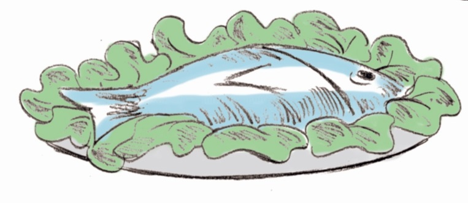
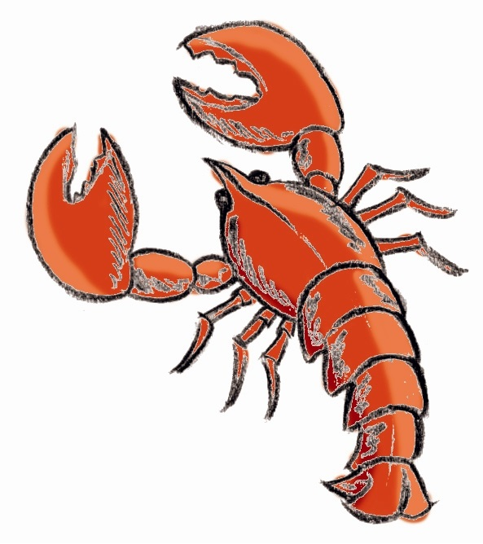

# Pescados y mariscos

El **pescado** se altera más rápidamente que la carne porque tiene un mayor contenido en agua, más cantidad de ácidos grasos insaturados que se oxidan fácilmente y poca cantidad de tejido muscular, siendo más vulnerable a los microorganismos. La vida útil en refrigeración es escasa, de 2 a 3 días. Por ello, la mejor forma de conservarlo mediante frío es la congelación. Si no se congela y descongela bien, disminuye la calidad gustativa del pescado, ya que, se forman pequeños cristales de hielo en la carne que dañan su estructura y hace que se pierdan líquidos, por lo que al cocinarlos se pueden desmenuzar (se aconseja congelar al menos a –18º C lo más rápidamente posible y descongelar poco a poco). El pescado fresco o descongelado debe tener la piel tersa, brillante y firme, las agallas rojas, las escamas brillantes y adheridas a la piel y los ojos brillantes, transparentes y no hundidos.

**¿Cómo cocinamos el pescado?**

La carne del pescado es distinta a la de los mamíferos y a de la de las aves; sus fibras son más cortas y el tejido conectivo más fino, por eso es más tierno y fácil de digerir, pero se cocina peor. Se recomiendan los tratamientos culinarios en un líquido ácido (vinagre o zumo de limón) porque coagula y fija las proteínas del pescado y al mismo tiempo elimina los olores a azufre y amoníaco. Cuando se fríen, la temperatura del aceite deber ser muy alta (200º C) y se debe rebozar en huevo o pan rallado para que este rebozado se transforme en una costra y evite el paso del aceite y la salida del agua. El ahumado no debe realizarse a temperaturas superiores a 80º C, y así evitaremos que se formen sustancias no deseables, aunque lo hagan en cantidades muy pequeñas (metanol, formaldehído, acetaldehído, fenol, guayacol…).

Banco de imágenes de la FEN. _Pescado cocinado_ (Todos los derechos reservados)

La conservación del pescado mediante el enlatado se hace más duradero si se somete a esterilización (100º C). Con esta técnica podemos incluso mejorar la calidad del pescado. Es el caso de las conservas elaboradas con aceite de oliva, que unen a las ventajas de los ácidos grasos ω-3, propios del pescado, la de los ácidos grasos monoinsaturados del aceite de cobertura. En el caso de los pescados que se comen con raspa y vísceras, se produce un importante aporte de calcio y de vitaminas liposolubles. 

**Mariscos y moluscos**

Los **crustáceos**, para mantenerlos vivos, deben estar en agua salada. Si se cocinan, el método más adecuado es introducirlos en una solución acuosa de sal (10-15%) hirviendo. El mayor problema de los moluscos es que son filtradores, se alimentan del plancton que va en el agua, filtrándola. En la actualidad esto no representa ningún problema pues antes de comercializarlos son depurados. Se suelen cocer durante 6 minutos, para que abran sus conchas. Pero si se cuecen más tiempo, se encoge su carne, perdiendo parte del  “flavor” característico. 

Banco de imágenes de la FEN. _Langosta_ (Todos los derechos reservados)