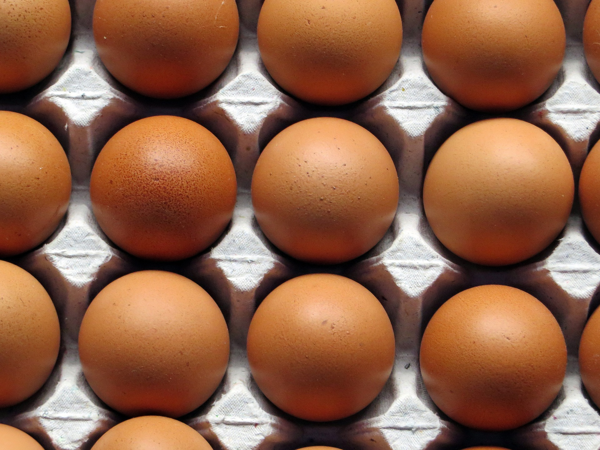
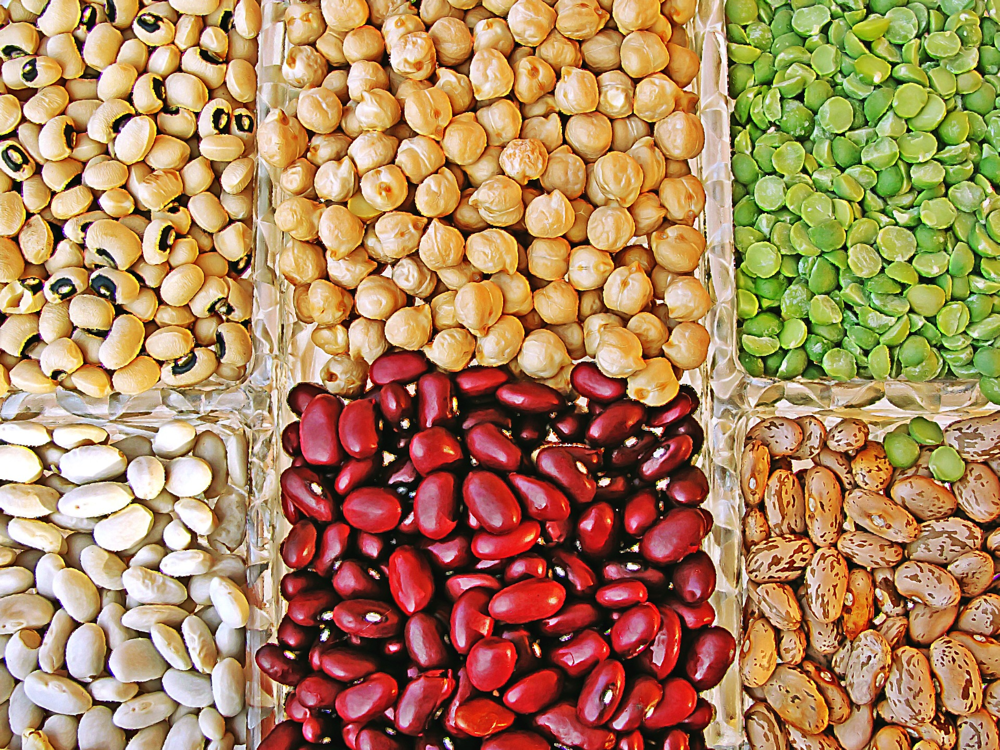

# Proteínas

La principal función de las proteínas es servir como **elementos plásticos** **que construyan y mantengan nuestras estructuras corporales**; sin embargo, si se consumen más proteínas de las que se necesitan para “construir y reparar” tejidos, este exceso se almacenará en forma de energía (grasa corporal). Además, las proteínas tienen una **función inmunológica, hormonal, de transporte y almacén** de otras sustancias.

Las proteínas son cadenas de aminoácidos. El ser humano puede sintetizar ciertos aminoácidos pero no todos. Existen **ocho** que deben ingerirse necesariamente y que reciben el nombre de **aminoácidos esenciales (isoleucina, leucina, lisina, metionina, fenilalanina, treonina, triptófano y valina)**. Cuando un alimento aporta todos los aminoácidos esenciales en la proporción adecuada que necesitamos para la síntesis de las proteínas corporales humanas decimos que tiene una proteína de buena calidad; cuantos más aminoácidos esenciales falten o estén en menor cantidad que la que se necesita, peor será la calidad proteica de ese alimento, o lo que es lo mismo, peor podremos aprovechar metabólicamente esa proteína. En general, los **alimentos de mayor calidad proteica** son el **huevo** (que se toma como proteína patrón), el **pescado**, la **carne** y los **lácteos**.

Las **proteínas vegetales** son de menor calidad; las legumbres son pobres en un determinado aminoácido esencial (metionina) y los cereales en otro (lisina). Tomados por separado, nos faltarían ciertos aminoácidos. Sin embargo, si tomamos juntos en una misma comida legumbres y cereales, el conjunto aporta una proteína de tan buena calidad como la del huevo o cualquier otro alimento de origen animal. Es lo que se llama **complementación proteica**, algo que venimos haciendo de manera intuitiva en la gastronomía tradicional desde siempre ( lentejas con arroz, pan con leche, moros y cristianos).

  

Fuente: [Pixabay](https://pixabay.com/es/huevos-cesta-del-huevo-brown-comer-1938189/)

  

Fuente: [Pixabay](https://pixabay.com/es/legumbres-alimentaci%C3%B3n-garbanzos-665788/)

