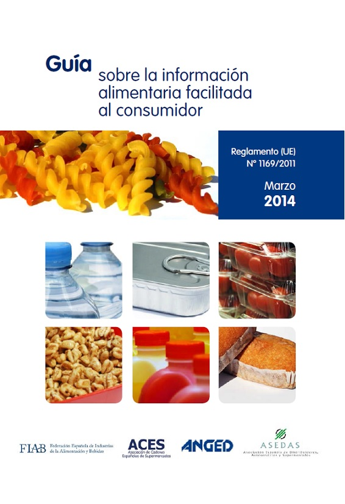

# Reglamento 1169/2011

En el caso del [**Reglamento (UE) nº 1169/2011**](http://eur-lex.europa.eu/LexUriServ/LexUriServ.do?uri=OJ:L:2011:304:0018:0063:es:PDF), sobre la información alimentaria facilitada al consumidor, este fue aprobado por el Parlamento Europeo y el Consejo el 25 de octubre y publicado en el Diario Oficial de la Unión Europea el 22 de noviembre de 2011. Entró en vigor el 12 de diciembre de 2011.

El presente Reglamento establece los principios generales, los requisitos y las responsabilidades que rigen la información alimentaria y, en particular, el etiquetado de los alimentos. Asimismo, establece los medios para garantizar el derecho de los consumidores a la información, así como los procedimientos para facilitar información alimentaria, teniendo en cuenta la necesidad de dar la flexibilidad suficiente para responder a los futuros avances y los nuevos requisitos de información

Respecto a las menciones obligatorias, en él se introducen como **novedades** el etiquetado obligatorio sobre **información nutricional** para la mayoría de los alimentos transformados y la indicación de todas las **sustancias o productos que causen alergias e intolerancias**. Toda la información referente a la legislación en materia de información alimentaria al consumidor se puede encontrar claramente explicada en el documento adjunto en la imagen, además de en el propio Reglamento.

Captura de pantalla de: [FIAB. Guía sobre la información alimentaria facilitada al consumidor](http://www.fiab.es/archivos/documentoMenu/documentomenu_20140320162214.pdf) 

Desde el **13 de diciembre de 2014**, alguno de los puntos que se introducen como **obligado cumplimiento** en el Reglamento 1169/2011 son:

1.  Estableciendo un **tamaño mínimo de fuente**. Si el envase es menor de 25 cm2, la información nutricional no será obligatoria y en los envases en los que la superficie más grande sea inferior a 10 cm2, no es necesario incorporar ni la información nutricional ni la lista de ingredientes. Lo que sí se deberá incluir siempre independientemente del tamaño son los alérgenos, el nombre del alimento, la cantidad neta y la fecha de duración mínima.
2.  Tipos de **carne distintas del vacuno** (porcino, ovino, caprino) frescas, refrigeradas o congeladas.
3.  Los **alérgenos** deberán aparecer en la lista de ingredientes diferenciándoles del resto con otra tipología como color, subrayado, negrita,etc.
4.  Además de indicar que son aceites o grasas vegetales, se deberá incluir el **origen vegetal específico**.