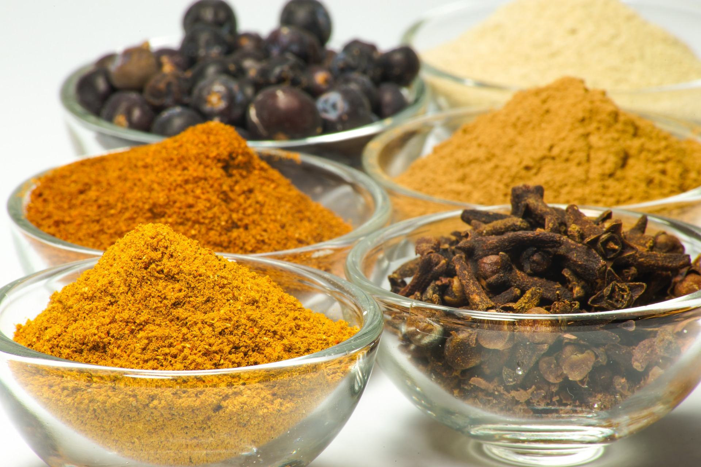

# Salsas, condimentos y especias

Los **condimentos** son sustancias añadidas a los alimentos con el fin de sazonarlos y mejorar su sabor. Mientras que las **especias** son sustancias aromáticas de origen vegetal utilizadas para sazonar los alimentos. La palabra condimento sería el genérico en el que se incluyen las especias.

Fuente de la imagen: [Pixabay](https://pixabay.com/es/especias-blanco-pimienta-541974/). Dominio público

La palabra **salsa** proviene del latín "salsus", salado, porque la sal era, en principio, el condimento esencial. Más tarde los romanos usaban el "garum", una especie de salmuera a base de pescados y vísceras de pescado. Desde sus inicios a la actualidad, las salsas han experimentado una curiosa evolución. El aporte de la salsa al alimento principal de un plato no es sólo organoléptico, también es nutricional. Como ejemplos en este grupo tan heterogéneo de alimentos tenemos: salsa barbacoa, salsa de soja, salsa rosa o mayonesa en el caso de las salsas: canela, pimienta, curry, laurel, ajo, perejil, eneldo... en caso de especias y condimentos.

El ejemplo más notable en este grupo se encuentra con la sal de mesa, aditivo más antiguo y más usado en alimentación, y uno de los principales pilares de la cocina en casi cualquier cultura. Las especias nos aportan un escaso valor nutricional debido a la poca cantidad que utilizamos (la ración usada en gastronomía no supera 1 gramo), pero aun así, lo tienen. Por ejemplo, en el caso del pimentón, aporta b-carotenos, que en nuestro organismo se transforma en vitamina A; la canela molida o el orégano seco destacan por su contenido en calcio y el perejil por la vitamina C.

Por último, en el caso de las salsas su valor energético va a ser muy variable, desde 66 kcal/100 gramos en el caso de la salsa de soja,159 kcal/100 gramos en la salsa bechamel o 544 kcal/100 g en la salsa césar. Pueden incluirse en nuestra dieta siempre y cuando se consuman con moderación y en el marco de una dieta saludable.