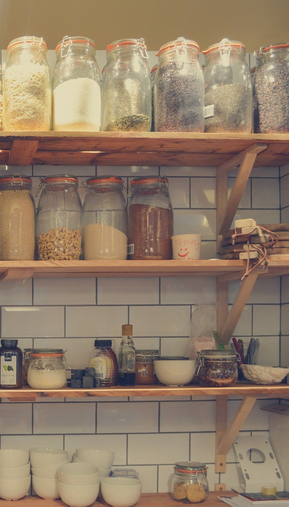

# Si almacenas en armarios y despensas...

*   La temperatura se debe ajustar entre 10ºC y 21ºC.

    
*   Se debe mantener el área limpia.
*   Cuartos de almacenamiento, fríos, secos y bien ventilados.
*   Se debe mantener los alimentos alejados de las paredes y suelos (para evitar insectos y roedores) y de la exposición a la luz directa del sol.
*   Un almacenamiento en envases adecuados en ambiente seco y aireado puede ayudar a prevenir el deterioro del alimento.
*   Es recomendable utilizar recipientes duraderos, que no dejen entrar el agua o las plagas.
*   Ejemplos de alimentos a conservar a temperatura ambiente: alimentos secos, deshidratados, latas, cereales (arroz, avena, pastas), botellas, legumbres secas, encurtidos, harinas, conservas, postres lácteos pasteurizados, aceites, vinos, azúcar, fritas, galletas, té, café,etc.