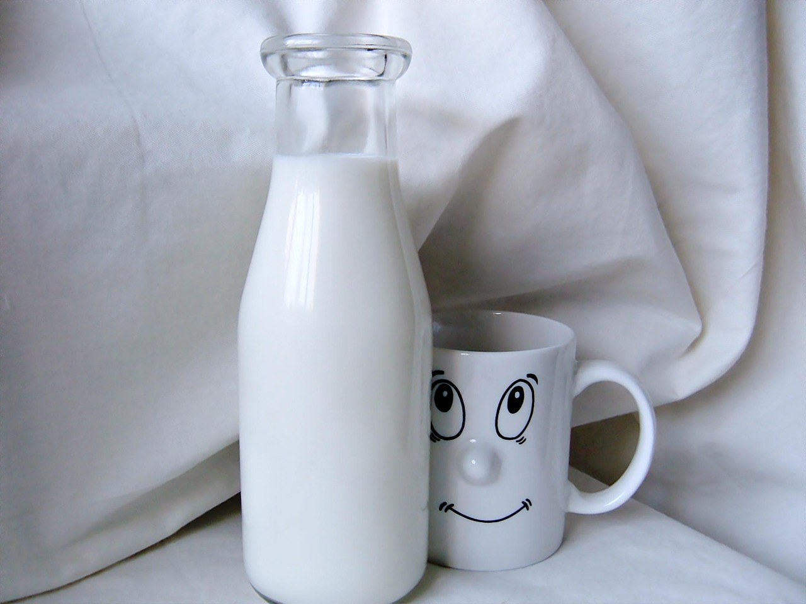

# ¿Tenemos buenas costumbres?

La forma de comer y el lugar donde se come son tan importantes como lo que se come. Para que haya una buena digestión de los alimentos y para que éstos se utilicen bien hay que cuidar todos aquellos aspectos que rodean la comida.

**Compartir la comida** es algo inherente al ser humano. Durante las comidas se enseñan las pautas de comportamiento adecuadas y, además, a sentir placer por los alimentos y por las distintas recetas y preparaciones culinarias. La familia, los amigos o los compañeros influyen de forma decisiva. Es en estos momentos cuando se adquieren los buenos y los malos hábitos en muchos aspectos alrededor de la alimentación. Lo que rodea la comida también cuenta y mucho: así, los ruidos, gritos, mala ventilación, humos, espacios estrechos, prisas y discusiones no favorecen la elección adecuada de los alimentos que conformen nuestra dieta.

Fuente [Pixabay](https://pixabay.com/es/comiendo-en-la-mesa-familiar-comedor-619142/)

Los **hábitos alimentarios** son una rica herencia sociocultural que estamos obligados a transmitir de generación en generación y las familias, son el lugar idóneo para la adquisición de estos conocimientos. En la infancia es cuando se consolidan unos hábitos alimentarios saludables, que nos acompañarán casi toda la vida hasta el envejecimiento.El arte de la mesa constituye un vector de la convivencia y un momento importante de socialización e influye positivamente en las relaciones sociales y familiares.No hay que olvidar que "la hora de desayunar-comer-cenar" debe ser lo más agradable y distendida posible. Las comidas familiares frecuentes se asocian a una mayor unión o cohesión familiar, una mayor interdependencia de todos sus miembros y un estado emocional de bienestar de éstos.  Comer toda la familia junta es muy importante. Las comidas en familia sirven de base de los recuerdos de alimentación que se forman en la infancia y que perduran a lo largo de toda la vida, recogiendo las experiencias sensoriales de los sentidos que intervienen en la alimentación (tacto, gusto, olfato, oído y vista). Se debe evitar “caer en la rutina”, se debe evitar que las comidas se conviertan en aburridas y monótonas.

Numerosos estudios muestran cómo la “**cena en familia**” se asocia con patrones de ingesta dietética más saludables: mayor consumo de frutas y verduras y, por consiguiente, sus numerosos efectos nutricionales –mayor ingesta de fibra, folatos, calcio, hierro, vitaminas B6, B12, C y E-. Se ha observado también que comer-cenar con la familia mejora el rendimiento escolar y psicológico. El momento de la comida, además, constituye una ocasión de comunicación familiar y social y sirve para transmitir tradiciones.Igual que ocurre en otros aspectos de la vida, la moda condiciona la alimentación en un momento determinado. Hay que tener en cuenta, que no todo lo que el mercado ofrece como novedoso es lo más adecuado ni aconsejable. La información y el espíritu crítico, ayudan a seleccionar adecuadamente los alimentos de acuerdo con la evidencia científica. Uno de los mejores regalos que los padres o profesores pueden ofrecer a los niños durante esta etapa de la infancia es una serie de hábitos saludables que lleven con ellos toda la vida.

Hay que tomarse en serio y es una de nuestras preocupaciones la falta o escaso desayuno que hacemos. Pues bien, sin duda, una de las buenas costumbres en alimentación es el hecho de **desayunar y hacerlo correctamente.** El desayuno es la primera comida que nuestro cuerpo recibe y hay que darle la importancia que se merece. Una buena parte de la energía (aproximadamente el 25%) y de los nutrientes que necesitamos al día se deben aportar con el desayuno, que debe contener lo que conocemos como la triada: un alimento del grupo de lácteos, una fruta y algún alimento del grupo de cereales como mínimo. La variedad en los desayunos es algo que debemos tener en cuenta para evitar la monotonía, algo que se aplica al resto de las comidas del día y que muchas veces se olvida para el desayuno. Podemos variar los desayunos: pan, bollería, churros o cereales para el desayuno; leche, yogur o queso; zumo de naranja, manzana u otras frutas, etc. Desayunar correctamente previene de la obesidad y mejora el rendimiento físico e intelectual.

Fuente [Pixabay](https://pixabay.com/es/leche-vaca-bebida-calcio-642734/)

Además, actualmente, los cambios sociales nos han obligado a pasar gran parte del día fuera de casa, con lo que de dos a tres comidas las hacemos fuera a tenor de lo que “decidan” los responsables del comedor o la empresa de _catering_, o bien sirviéndose de bocadillos. Esto debe tenerse muy en cuenta a la hora de elaborar las comidas que se realizan dentro de casa, de forma que se compensen las posibles deficiencias que podrían producirse. **La cena debe ser complementaria de la comida** y tomar aquellos alimentos que contengan nutrientes que no se han recibido en las comidas anteriores.

Realizar una **correcta elección de alimentos** que constituyan nuestra dieta es importante para evitar malnutrición por defecto, deficiencias de micronutrientes, trastornos del comportamiento alimentario que conducen a enfermedades graves como la anorexia nerviosa y la bulimia, así como para evitar malnutrición por exceso, que conduce al sobrepeso y obesidad, con graves repercusiones en la salud.