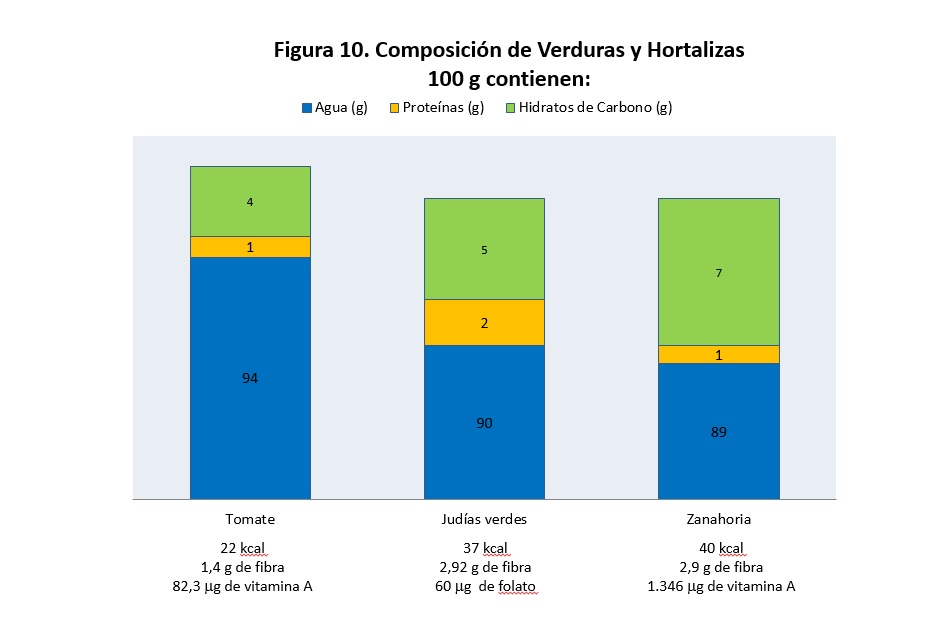

# Verduras y hortalizas

Las verduras y hortalizas son alimentos con un **bajo valor energético y elevado contenido de agua (75-90%), fibra, vitaminas y minerales**. Bajo la denominación de verduras y hortalizas se incluye una gran diversidad de alimentos de origen vegetal, de frecuente consumo en nuestro país, incluye todos los alimentos vegetales que no son frutas, cereales, legumbres -desecadas-, ni frutos secos.

Las hortalizas son aquellas partes de los vegetales que, en estado fresco, sin desecar al aire, crudas, conservadas o preparadas de diversas formas, se utilizan para el consumo humano, con excepción de los frutos procedentes de los árboles frutales. Las verduras son un grupo de hortalizas en las que la parte comestible está constituida por sus órganos verdes (hojas, tallos o inflorescencias). Las legumbres frescas son otro tipo de hortalizas en las que la parte comestible es el fruto o la semilla no madura.

Desde el punto de vista botánico, esta definición engloba un grupo muy diverso en el que se encuentran representadas familias botánicas muy diferentes, así como distintas partes de las plantas.Por ejemplo, las **[acelgas](http://www.fen.org.es/mercadoFen/pdfs/acelga.pdf "Acelgas")**, las **[espinacas](http://www.fen.org.es/mercadoFen/pdfs/espinacas.pdf "Espinacas")** y la **[lechuga](http://www.fen.org.es/mercadoFen/pdfs/lechuga.pdf "Lechuga")**  son hojas. El **[apio](http://www.fen.org.es/mercadoFen/pdfs/apio.pdf "Apio")** es un tallo, las **[alcachofas](http://www.fen.org.es/mercadoFen/pdfs/alcachofa.pdf "Alcachofa")** una flor; la **[remolacha](http://www.fen.org.es/mercadoFen/pdfs/remolacha.pdf "Remolacha")**, las **[zanahorias](http://www.fen.org.es/mercadoFen/pdfs/zanahoria.pdf "Zanahoria")** y la **[patata](http://www.fen.org.es/mercadoFen/pdfs/patata.pdf "Patata")** son raíces y los **[ajos](http://www.fen.org.es/mercadoFen/pdfs/ajo.pdf "Ajo")** y **[cebollas](http://www.fen.org.es/mercadoFen/pdfs/cebolla.pdf "Cebolla")** son bulbos. El **[tomate](http://www.fen.org.es/mercadoFen/pdfs/tomate.pdf "Tomate")** es un fruto.

Las hortalizas muy coloreadas, como el tomate y la zanahoria, contienen gran cantidad de vitamina A y las verduras de color verde son fuente alimentaria de folato, una vitamina del grupo B.

 Banco de imágenes de la FEN. _Composición de verduras y hortalizas_