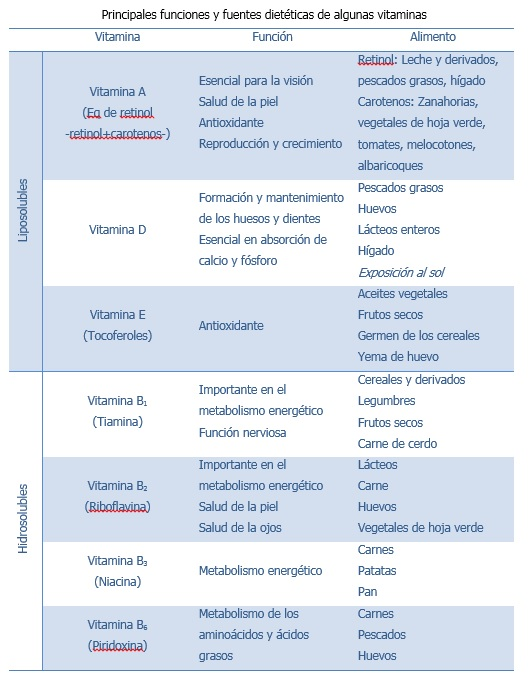

# Vitaminas

Las vitaminas son nutrientes que se encuentran en pequeñas cantidades en los alimentos. Nuestro organismo también los necesita en poca cantidad pero son **imprescindibles para su buen funcionamiento**. Así, cuando no consumimos todas las vitaminas en cantidad suficiente, aparecen enfermedades carenciales. En la actualidad se conocen **13 vitaminas**, con estructuras muy diferentes que, aparte de por su nombre químico (tiamina, ácido ascórbico, riboflavina,etc.) se nombran con las letras del abecedario y subíndices numéricos.

Cuatro son **vitaminas liposolubles:** la vitamina **A**, que es imprescindible para la visión y para el mantenimiento de la piel, mucosas y para las defensas corporales; la vitamina **D**, cuya misión principal  es favorecer la absorción del calcio y el mantenimiento de una buena salud ósea; la vitamina E, con un potente efecto antioxidante que ayuda a mantener las membranas celulares y a enlentecer el envejecimiento; y la vitamina K, que participa en la coagulación sanguínea. Las **vitaminas hidrosolubles (tiamina, riboflavina, niacina, biotina, vitamina B6, ácido pantoténico, ácido fólico, vitamina B12 y vitamina C)**, participan fundamentalmente en los procesos celulares de obtención de energía, pero también en la síntesis de glóbulos rojos (B12 y folato) y otras funciones celulares de importancia. La vitamina C es antioxidante y además es fundamental para la formación del tejido conjuntivo.

Todos los alimentos contienen vitaminas. **Frutas, verduras y hortalizas son especialmente ricas en ellas**. La vitamina B12 sólo se encuentra en la naturaleza en  productos de origen animal aunque en la actualidad podemos encontrar alimentos procesados de origen vegetal enriquecidos con esta vitamina, como algunos cereales del desayuno. Además, los humanos somos capaces de sintetizar dos vitaminas, la vitamina D y la K, pero a veces no en cantidad suficiente para cubrir nuestros requerimientos, por lo que será necesario tomar cierta cantidad a través de la dieta. La vitamina D se sintetiza en la piel gracias a la acción del sol sobre una molécula derivada del colesterol; la vitamina K la sintetizan las bacterias que colonizan nuestro intestino. La función de las diferentes vitaminas en nuestro organismo es una continua materia de estudio. Así, hoy se sabe que más allá de necesitar una ingesta que evite enfermedades por carencias, un consumo adecuado previene además de ciertas enfermedades; por ejemplo, el folato previene algunas malformaciones fetales, la vitamina E ayuda a disminuir el riesgo de enfermedades cardiovasculares y la vitamina D a prevenir la osteoporosis y ciertos tipos de cáncer.

Banco de imágenes de la FEN. _Principales funciones y fuentes dietéticas de algunas vitaminas_